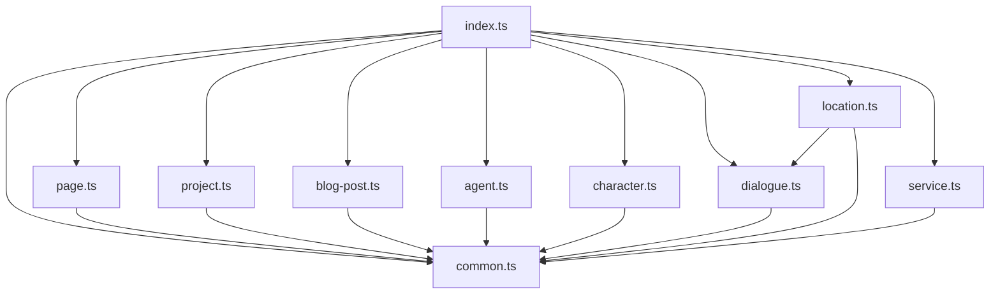
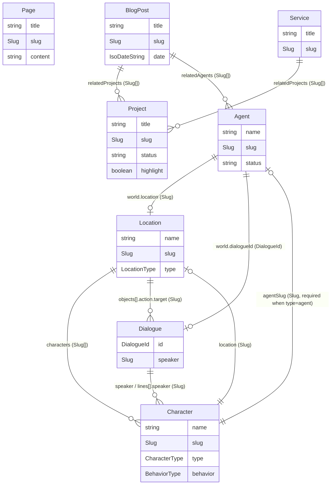

# Design Document: Content Entity Types

## Overview

This design defines the TypeScript type architecture for all content entities in the project. These types form the data contract between the content system (MDX + YAML/JSON files) and all presentation layers (classic view, play view, game-boy UI). They are pure shape definitions — no runtime behavior, no persistence logic, no validation.

### Key Design Decisions

1. **Branded type aliases for semantic intent** — `Slug`, `IsoDateString`, `AssetPath`, `DialogueId`, and `LineId` are compile-time semantic markers using TypeScript's branded type pattern (`string & { readonly __brand: unique symbol }`). They communicate intent in function signatures and prevent accidental misuse of raw strings. Format validation is deferred to the content-loader spec.

2. **String literal unions over enums** — All discriminated unions (`CharacterType`, `BehaviorType`, `LocationType`, `ActionType`, `TransitionDirection`, status fields) use string literal union types. This avoids enum runtime overhead, works naturally with JSON/YAML content, and aligns with TypeScript strict mode best practices.

3. **Discriminated union for Character agent narrowing** — When `Character.type === 'agent'`, the `agentSlug` field becomes required. This is enforced via TypeScript type narrowing (a union of `AgentCharacter` and `NonAgentCharacter` types), not documentation alone. This is the only inter-type constraint enforced at the type level.

4. **One-way dependencies, no circular imports** — In this design, the only planned cross-entity import is `location.ts → dialogue.ts` (for `DialogueAction`). The architecture should preserve one-way dependencies and avoid circular imports. If future needs require additional cross-entity imports, they must remain acyclic.

5. **Shared utility types in `common.ts`** — All reusable type aliases and small structural types live in a single shared file. Entity-specific types live in their own files. The barrel export at `index.ts` re-exports everything.

6. **Optional nested objects for Agent** — The `world` and `software` fields on Agent are optional objects, not separate types. This keeps the Agent definition self-contained while allowing classic view to ignore world/software config entirely.

7. **Content types are not database models** — No `id` fields (except Dialogue/DialogueLine which use `id` as content identifiers for line referencing), no timestamps, no status flags, no SEO metadata. These concerns belong in other layers.

## Architecture

```
src/lib/types/
├── common.ts          ← Shared utility types (Slug, IsoDateString, Position2D, etc.)
├── page.ts            ← Page interface
├── project.ts         ← Project interface
├── blog-post.ts       ← BlogPost interface
├── agent.ts           ← Agent interface (triple nature)
├── character.ts       ← Character interface + discriminated union
├── dialogue.ts        ← Dialogue, DialogueLine, DialogueChoice, DialogueAction, ActionType
├── location.ts        ← Location, InteractiveObject, LocationTransition (imports from dialogue.ts)
├── service.ts         ← Service interface
└── index.ts           ← Barrel export (re-exports all)
```

### Dependency Graph



All entity files import from `common.ts`. In this design, the only planned cross-entity import is `location.ts → dialogue.ts` (for `DialogueAction`). The architecture should preserve one-way dependencies and avoid circular imports.

## Components and Interfaces

### Shared Utility Types (`common.ts`)

| Type | Kind | Purpose |
|---|---|---|
| `Slug` | Branded string alias | URL-safe kebab-case content identifier |
| `IsoDateString` | Branded string alias | ISO 8601 date string |
| `AssetPath` | Branded string alias | File path to visual asset |
| `DialogueId` | Branded string alias | Dialogue content identifier |
| `LineId` | Branded string alias | Dialogue line identifier |
| `Position2D` | Interface | `{ x: number; y: number }` |
| `TransitionDirection` | String literal union | `'north' \| 'south' \| 'east' \| 'west' \| 'up' \| 'down'` |

Branded types use the pattern:
```typescript
type Slug = string & { readonly __brand: unique symbol };
```
This makes `Slug` assignable from `string` only via explicit cast, catching accidental raw string usage at call sites. The content loader will handle runtime format validation.

### Entity Interfaces

Each entity file exports one primary interface (and supporting types where needed). All use semantic type aliases from `common.ts` instead of raw `string`.

#### Page (`page.ts`)
Simple content page. Required: `title`, `slug`, `content`. Optional: `description`.

#### Project (`project.ts`)
Portfolio entry. Required: `title`, `slug`, `description`, `content`, `stack`, `categories`, `status`, `highlight`. Optional: `links` (with optional `live`, `github`, `demo`), `image`, `order`. Status is a string literal union: `'completed' | 'in-progress' | 'ongoing'`.

#### BlogPost (`blog-post.ts`)
Article/tutorial. Required: `title`, `slug`, `excerpt`, `content`, `date`, `categories`, `tags`. Optional: `image`, `relatedProjects`, `relatedAgents`. Cross-references use `Slug` arrays.

#### Agent (`agent.ts`)
Triple-nature entity. Required top-level: `name`, `slug`, `role`, `personality`, `capabilities`, `status`. Optional: `portrait`, `world` (nested object with required `location` and optional `sprite`, `position`, `dialogueId`), `software` (nested object with required `availability` and optional `model`, `systemPrompt`, `tools`).

#### Character (`character.ts`)
World inhabitant with discriminated type field. Exports `CharacterType`, `BehaviorType`, and the `Character` type. The `Character` type is a union of `AgentCharacter` (where `type: 'agent'` and `agentSlug` is required) and `NonAgentCharacter` (where `type` is any other `CharacterType` value and `agentSlug` is optional). Both share a common base shape.

#### Dialogue (`dialogue.ts`)
Conversation system types. Exports `ActionType`, `DialogueAction`, `DialogueChoice`, `DialogueLine`, `Dialogue`. `DialogueChoice` can have both `nextLineId` and `action` — the action fires and dialogue continues. `DialogueLine.condition` is a string expression whose grammar is deferred to the dialogue engine spec.

#### Location (`location.ts`)
World area definition. Exports `LocationType`, `InteractiveObject`, `LocationTransition`, `Location`. Imports `DialogueAction` from `dialogue.ts` for `InteractiveObject.action`. `LocationTransition.direction` uses `TransitionDirection` from common.

#### Service (`service.ts`)
Professional offering. Required: `title`, `slug`, `description`, `content`. Optional: `relatedProjects`, `cta` (with required `text` and `href`), `order`.

### Barrel Export (`index.ts`)

Re-exports all types from all entity files. Consumers import from `@/lib/types` without knowing internal file structure. The specific re-export syntax (`export type *`, `export *`, named re-exports) is an implementation detail determined by the project's TypeScript configuration.

## Content Shape Relationships

These types define the shape of content entities as loaded from MDX + YAML/JSON files. Key structural relationships:



### Cross-Reference Validation Tiers

Guarantees are classified into three tiers (see Requirement 10 for full details):

| Tier | What | Enforced By |
|---|---|---|
| Type-level | Character `type === 'agent'` requires `agentSlug` | TypeScript discriminated union |
| Type-level | String literal unions (not enums) for all union types | TypeScript compiler |
| Runtime | Slug cross-references resolve to existing entities | Content loader (future spec) |
| Runtime | Branded type format validation (kebab-case, ISO 8601, etc.) | Content loader (future spec) |
| Documentation | `condition` expression grammar | Dialogue engine spec (future) |
| Documentation | `InteractiveObject.action` uses full `ActionType` set | Code comments |
| Documentation | `speaker` fields use `Slug` (all speakers are Characters, for now) | Code comments |


## Correctness Properties

*A property is a characteristic or behavior that should hold true across all valid executions of a system — essentially, a formal statement about what the system should do. Properties serve as the bridge between human-readable specifications and machine-verifiable correctness guarantees.*

### Property 1: Semantic type alias consistency

*For any* field across all entity interfaces that represents a slug, date, asset path, 2D position, dialogue identifier, or line identifier, that field SHALL use the corresponding semantic type alias (`Slug`, `IsoDateString`, `AssetPath`, `Position2D`, `DialogueId`, `LineId`) instead of raw `string` or inline `{ x: number; y: number }`.

**Validates: Requirements 1.9, 1.10, 1.11, 1.12, 1.13, 1.14**

### Property 2: Character agent type narrowing

*For any* Character value where `type === 'agent'`, the `agentSlug` field SHALL be required (present and of type `Slug`). *For any* Character value where `type` is not `'agent'`, the `agentSlug` field SHALL be optional.

**Validates: Requirements 10.1**

### Property 3: String literal unions only

*For any* union type in the type system (`CharacterType`, `BehaviorType`, `LocationType`, `ActionType`, `TransitionDirection`, and all status fields on `Project`, `Agent`, `Agent.software`), the type SHALL be defined as a string literal union, not a TypeScript `enum`.

**Validates: Requirements 10.2, 12.3**

### Property 4: Barrel export completeness

*For any* type exported from any individual entity file under `src/lib/types/`, that type SHALL also be importable from `src/lib/types/index.ts`.

**Validates: Requirements 11.1**

### Property 5: No circular dependencies

*For any* pair of type files under `src/lib/types/`, there SHALL be no circular import path between them. In this design, the only planned cross-entity import is `location.ts → dialogue.ts` (one-way).

**Validates: Requirements 11.4, 12.4**

### Property 6: Strict mode compilation

*For all* type files under `src/lib/types/`, they SHALL compile with zero TypeScript errors under strict mode (which includes `noImplicitAny`, `strictNullChecks`, `strictFunctionTypes`, etc.).

**Validates: Requirements 12.1, 12.2**

### Property 7: Export syntax correctness

*For all* type definitions across all files under `src/lib/types/`, each SHALL use `export interface` or `export type` syntax exclusively. No default exports, no `const` exports, no runtime values.

**Validates: Requirements 12.5**

## Error Handling

No runtime error handling applies — these are pure type definitions. All errors are compile-time (type mismatches, missing fields, circular imports, implicit `any`). The content loader (future spec) handles runtime errors: malformed slugs, invalid dates, missing cross-references, broken asset paths.

## Testing Strategy

This spec defines pure type definitions with no runtime logic. The testing strategy is lightweight and appropriate for the problem:

### Primary Verification: TypeScript Compiler

```bash
tsc --noEmit             # Strict mode typecheck, zero errors (validates P6)
pnpm build               # Full build gate (implicitly runs tsc)
pnpm lint                # No lint errors in type files
```

A successful `tsc --noEmit` is the primary verification gate. It validates strict mode compliance, no implicit any, correct import paths, and type consistency.

### Type-Level Tests

Use `tsd` or `expectTypeOf` (from Vitest) for compile-time type assertions:

| Property | Test Approach |
|---|---|
| P1: Semantic type alias consistency | Assign raw `string` to `Slug` field → expect TS error. Verify branded fields reject plain strings. |
| P2: Character agent type narrowing | Verify `AgentCharacter` requires `agentSlug`. Verify other character types make it optional. |
| P3: String literal unions only | Verify union types accept valid literals and reject invalid ones. |
| P4: Barrel export completeness | Import all types from `index.ts` → verify each type is defined and matches the individual module export. |
| P7: Export syntax correctness | Verify no runtime values are exported (type-only modules). |

### Static Analysis

| Property | Test Approach |
|---|---|
| P5: No circular dependencies | Verify the dependency graph is acyclic. Can be checked via `madge` or manual import inspection. |

### What NOT to Test

- Runtime format validation (deferred to content-loader spec)
- Cross-reference integrity (deferred to content-loader spec)
- Condition expression parsing (deferred to dialogue engine spec)
- Content file existence or correctness (not this spec's concern)
- Random instance generation / property-based testing with fast-check (overkill for pure type definitions with no runtime logic)
