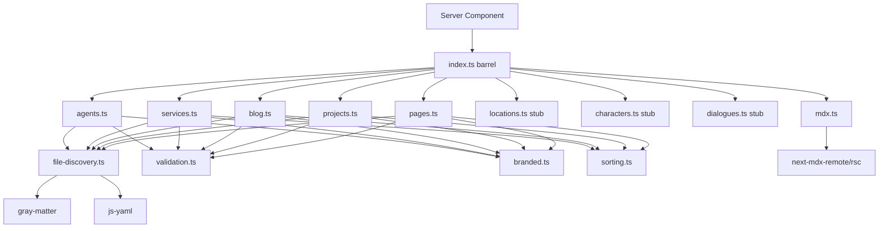

# Design Document: Content Loader

## Overview

The content loader is a set of TypeScript modules in `src/lib/content/` that bridge raw content files on disk (`content/`) with typed objects consumed by Next.js Server Components. It replaces the abandoned Contentlayer2 approach with a simple, file-system-based strategy using three parsing libraries: `gray-matter` (MDX frontmatter), `js-yaml` (YAML files), and `next-mdx-remote` (MDX rendering).

### Key Design Decisions

1. **Shared utility core, thin per-type modules** — Common logic (file discovery, validation, branded type casting, sorting) lives in internal utility modules. Each content type module (`pages.ts`, `blog.ts`, etc.) is a thin wrapper that configures the shared core with type-specific metadata (directory path, required fields, sort comparator). This avoids duplicating validation and file-reading logic across 5+ modules.

2. **Fail-fast validation** — List functions throw on the first invalid file. No partial results. This catches content errors during `next build` rather than silently producing incomplete data in production.

3. **By-slug uses filename lookup, not content scan** — `getXBySlug(slug)` constructs the expected file path from the slug and reads that single file. It does not scan all files and filter. This is O(1) per lookup and enforces the "filename is canonical slug" rule.

4. **Branded type casting is centralized** — A single `castBrandedTypes` utility handles all `Slug`, `IsoDateString`, `AssetPath` casting based on a per-type field map. This keeps the casting logic in one place and makes it easy to add new branded fields.

5. **Validation scope is intentionally narrow** — The loader checks: required field presence, non-null/non-undefined, array shape for array fields, parseable file format, and slug match. It does NOT check string-vs-number, enum membership, boolean coercion, or IsoDateString format. YAML/frontmatter parsers handle most type coercion naturally.

6. **Sort comparators are pure functions** — Each content type's sort logic is a standalone comparator function, making it unit-testable in isolation. The sorting rules (order-then-title, date-then-title, title-only) are implemented as composable comparator helpers.

7. **Directory resilience via graceful fallback** — If a content directory doesn't exist or is empty, list functions return `[]` and by-slug functions return `null`. No errors thrown for missing directories.

8. **MDX rendering is a thin wrapper** — The `mdx.ts` module wraps `next-mdx-remote/rsc`'s `MDXRemote` component. It accepts a raw MDX string and returns a React element. Custom components and plugins are deferred to the UI spec.

## Architecture

```
src/lib/content/
├── index.ts              ← Barrel export (R9)
├── pages.ts              ← Page loader (R2)
├── projects.ts           ← Project loader (R2)
├── blog.ts               ← BlogPost loader (R2)
├── services.ts           ← Service loader (R2)
├── agents.ts             ← Agent YAML loader (R4)
├── locations.ts          ← Stub loader (R5)
├── characters.ts         ← Stub loader (R5)
├── dialogues.ts          ← Stub loader (R5)
├── mdx.ts                ← MDX rendering utility (R8)
└── utils/
    ├── file-discovery.ts ← File reading, directory listing, slug derivation (R13, R12)
    ├── validation.ts     ← Required field checks, array shape, slug match (R6)
    ├── sorting.ts        ← Sort comparators for each content type (R3)
    └── branded.ts        ← Branded type casting (R7)
```



### Data Flow

1. **List function called** → `file-discovery` reads directory, filters by extension, skips `_` prefix and `.gitkeep`
2. **For each file** → Parse content (`gray-matter` for MDX, `js-yaml`/`JSON.parse` for YAML/JSON)
3. **Validate** → Check required fields, array shapes, slug match against filename
4. **Cast** → Apply branded type casting (`Slug`, `IsoDateString`, `AssetPath`)
5. **Sort** → Apply type-specific comparator
6. **Return** → Typed array

For by-slug: construct path → check file exists → parse → validate → cast → return (or `null`).

## Components and Interfaces

### File Discovery (`src/lib/content/utils/file-discovery.ts`)

Responsible for reading content directories and individual files. All file I/O is centralized here.

```typescript
/** Configuration for a content directory. */
interface ContentDirConfig {
  /** Relative path from project root, e.g. 'content/pages' */
  dir: string;
  /** Accepted file extensions, e.g. ['.mdx'] or ['.yaml', '.json'] */
  extensions: string[];
}

/** Result of reading a single content file. */
interface RawContentFile {
  /** Absolute file path */
  filePath: string;
  /** Slug derived from filename (without extension) */
  fileSlug: string;
  /** Parsed data (frontmatter for MDX, parsed YAML/JSON for structured files) */
  data: Record<string, unknown>;
  /** Raw body content (MDX body after frontmatter; empty string for YAML/JSON) */
  body: string;
}

/**
 * List all content files in a directory matching the configured extensions.
 * Skips files starting with `_` and `.gitkeep`.
 * Returns empty array if directory doesn't exist or is empty.
 */
function listContentFiles(config: ContentDirConfig): Promise<RawContentFile[]>;

/**
 * Read a single content file by slug.
 * Tries each configured extension in order.
 * Returns null if no matching file exists.
 */
function readContentFileBySlug(
  config: ContentDirConfig,
  slug: string
): Promise<RawContentFile | null>;

/**
 * Resolve the content root directory.
 * Uses process.cwd() as base.
 */
function getContentRoot(): string;
```

Parsing strategy per extension:
- `.mdx` → `gray-matter(fileContent)` → `{ data: frontmatter, content: mdxBody }`
- `.yaml` → `jsYaml.load(fileContent)` → parsed object
- `.json` → `JSON.parse(fileContent)` → parsed object

Parse errors are caught and re-thrown with the format: `Content parse error: <file-path> — <parser-error-message>` (R6.4, R6.5, R6.6).

### Validation (`src/lib/content/utils/validation.ts`)

Validates parsed content data against per-type rules.

```typescript
/** Validation configuration for a content type. */
interface ValidationConfig {
  /** Fields that must be present and non-null/non-undefined */
  requiredFields: string[];
  /** Fields that must be arrays if present */
  arrayFields: string[];
}

/**
 * Validate a parsed content object.
 * Throws on first validation failure with descriptive error message.
 * Also validates that declared slug matches filename-derived slug.
 */
function validateContent(
  data: Record<string, unknown>,
  filePath: string,
  fileSlug: string,
  config: ValidationConfig
): void;
```

Validation checks in order:
1. For each required field: check `field in data && data[field] != null` → error format: `Content validation error: <file-path> is missing required field "<field-name>"` (R6.1, R6.2, R6.7)
2. For each array field: if present and non-null, check `Array.isArray(data[field])` → error format: `Content validation error: <file-path> field "<field-name>" must be an array` (R6.3)
3. Slug match: check `data.slug === fileSlug` → error format: `Content validation error: <file-path> declared slug "<declared-slug>" does not match filename-derived slug "<filename-slug>"` (R13.6)

### Branded Type Casting (`src/lib/content/utils/branded.ts`)

Casts raw string values to branded types after validation.

```typescript
import type { Slug, IsoDateString, AssetPath } from '@/lib/types';

/** Field-to-brand mapping for a content type. */
interface BrandedFieldMap {
  /** Fields to cast to Slug */
  slugFields: string[];
  /** Fields to cast to IsoDateString */
  dateFields: string[];
  /** Fields to cast to AssetPath */
  assetFields: string[];
  /** Fields that are Slug[] arrays */
  slugArrayFields: string[];
}

/**
 * Apply branded type casts to a parsed content object.
 * Mutates the object in place for efficiency.
 * The 'slug' field is always cast to Slug.
 */
function applyBrandedCasts(
  data: Record<string, unknown>,
  fieldMap: BrandedFieldMap
): void;
```

Casting is a simple `as` cast at runtime (branded types are compile-time only). The function iterates over the field map and applies `value as Slug`, `value as IsoDateString`, etc. For array fields (`slugArrayFields`), it maps each element.

### Sorting (`src/lib/content/utils/sorting.ts`)

Pure comparator functions for each content type's sort order.

```typescript
import type { BlogPost, Project, Service, Page } from '@/lib/types';

/** Blog posts: date descending, then title ascending (case-insensitive). */
function compareBlogPosts(a: BlogPost, b: BlogPost): number;

/** Projects: order ascending (0 valid, undefined last), then title ascending (case-insensitive). */
function compareProjects(a: Project, b: Project): number;

/** Services: order ascending (0 valid, undefined last), then title ascending (case-insensitive). */
function compareServices(a: Service, b: Service): number;

/** Pages: title ascending (case-insensitive). */
function comparePages(a: Page, b: Page): number;
```

Order field handling:
- `0` is a valid order value and sorts before `1`
- `undefined` order sorts after all defined order values
- Comparison: `a.order ?? Infinity` vs `b.order ?? Infinity` (treats undefined as Infinity)

Title comparison uses `a.title.localeCompare(b.title, undefined, { sensitivity: 'base' })` for case-insensitive sorting. The `sensitivity: 'base'` option ignores case and diacritics, providing stable cross-platform behavior.

### MDX Content Loader Pattern (R2)

Each MDX loader module (`pages.ts`, `projects.ts`, `blog.ts`, `services.ts`) follows the same pattern:

```typescript
// Example: pages.ts
import type { Page } from '@/lib/types';
import type { RawContentFile } from './utils/file-discovery';
import { listContentFiles, readContentFileBySlug } from './utils/file-discovery';
import { validateContent } from './utils/validation';
import { applyBrandedCasts } from './utils/branded';
import { comparePages } from './utils/sorting';

const DIR_CONFIG = { dir: 'content/pages', extensions: ['.mdx'] };
const VALIDATION = { requiredFields: ['title', 'slug'], arrayFields: [] };
const BRANDED = { slugFields: ['slug'], dateFields: [], assetFields: [], slugArrayFields: [] };

function toPage(raw: RawContentFile): Page {
  validateContent(raw.data, raw.filePath, raw.fileSlug, VALIDATION);
  applyBrandedCasts(raw.data, BRANDED);
  return { ...raw.data, content: raw.body } as Page;
}

export async function getPages(): Promise<Page[]> {
  const files = await listContentFiles(DIR_CONFIG);
  return files.map(toPage).sort(comparePages);
}

export async function getPageBySlug(slug: string): Promise<Page | null> {
  const file = await readContentFileBySlug(DIR_CONFIG, slug);
  if (!file) return null;
  return toPage(file);
}
```

### YAML Content Loader (`agents.ts`) (R4)

Same pattern but with `.yaml` and `.json` extensions, no body content:

```typescript
const DIR_CONFIG = { dir: 'content/agents', extensions: ['.yaml', '.json'] };
const VALIDATION = {
  requiredFields: ['name', 'slug', 'role', 'personality', 'capabilities', 'status'],
  arrayFields: ['capabilities'],
};
const BRANDED = {
  slugFields: ['slug'],
  dateFields: [],
  assetFields: ['portrait'],
  slugArrayFields: [],
};
```

Note: Agent uses `name` not `title`, but the slug field is still `slug`. Agent nested fields (`world.location`, `world.sprite`, `world.dialogueId`) contain branded types but are deferred to the world engine phase — the initial loader does not cast nested fields. When the world engine spec lands, `branded.ts` will be extended with dot-path support (e.g. `'world.location'` in the field map) rather than special-case logic per type.

### Stub Loaders (R5)

Minimal modules that return empty results with a deferred-implementation comment:

```typescript
// locations.ts
import type { Location } from '@/lib/types';

// Implementation deferred to the world engine spec.

export async function getLocations(): Promise<Location[]> {
  return [];
}

export async function getLocationBySlug(slug: string): Promise<Location | null> {
  return null;
}
```

Same pattern for `characters.ts` and `dialogues.ts`.

### MDX Rendering Utility (`mdx.ts`) (R8)

The MDX rendering utility is a React Server Component wrapper, not a plain function. It returns `JSX.Element` (React element). Custom components and plugins are deferred to the UI spec — the initial implementation passes no custom components.

```typescript
import { MDXRemote } from 'next-mdx-remote/rsc';
import type { JSX } from 'react';

/**
 * Render a raw MDX string as a React Server Component element.
 * Returns JSX.Element for use in Server Components.
 * Custom components deferred to UI spec — will be added via optional `components` param.
 */
export function renderMDX(source: string): JSX.Element {
  return MDXRemote({ source });
}
```

### Barrel Export (`index.ts`) (R9)

```typescript
// Content loaders
export { getPages, getPageBySlug } from './pages';
export { getProjects, getProjectBySlug } from './projects';
export { getBlogPosts, getBlogPostBySlug } from './blog';
export { getServices, getServiceBySlug } from './services';
export { getAgents, getAgentBySlug } from './agents';

// Stub loaders (world engine — deferred)
export { getLocations, getLocationBySlug } from './locations';
export { getCharacters, getCharacterBySlug } from './characters';
export { getDialogues, getDialogueBySlug } from './dialogues';

// MDX rendering
export { renderMDX } from './mdx';
```

## Data Models

No new data models are introduced. The content loader consumes the existing TypeScript interfaces from `src/lib/types/` (Spec 2) and returns instances of those types. The internal utility interfaces (`ContentDirConfig`, `ValidationConfig`, `BrandedFieldMap`, `RawContentFile`) are implementation details not exported to consumers.

### Per-Type Configuration Summary

| Content Type | Directory | Extensions | Required Fields | Array Fields | Sort |
|---|---|---|---|---|---|
| Page | `content/pages` | `.mdx` | `title`, `slug` | — | title asc |
| Project | `content/projects` | `.mdx` | `title`, `slug`, `description`, `stack`, `categories`, `status`, `highlight` | `stack`, `categories` | order asc → title asc |
| BlogPost | `content/blog` | `.mdx` | `title`, `slug`, `excerpt`, `date`, `categories`, `tags` | `categories`, `tags` | date desc → title asc |
| Service | `content/services` | `.mdx` | `title`, `slug`, `description` | — | order asc → title asc |
| Agent | `content/agents` | `.yaml`, `.json` | `name`, `slug`, `role`, `personality`, `capabilities`, `status` | `capabilities` | — (no sort specified) |
| Location | `content/locations` | `.yaml`, `.json` | — (stub) | — | — |
| Character | `content/characters` | `.yaml`, `.json` | — (stub) | — | — |
| Dialogue | `content/dialogues` | `.yaml`, `.json` | — (stub) | — | — |

### Branded Type Field Map

| Content Type | Slug Fields | Date Fields | Asset Fields | Slug Array Fields |
|---|---|---|---|---|
| Page | `slug` | — | — | — |
| Project | `slug` | — | `image` | — |
| BlogPost | `slug` | `date` | `image` | `relatedProjects`, `relatedAgents` |
| Service | `slug` | — | — | `relatedProjects` |
| Agent | `slug` | — | `portrait` | — |

Note: Agent nested fields (`world.location`, `world.sprite`, `world.dialogueId`) contain branded types but are deferred to the world engine phase — the initial loader does not cast them. When the world engine spec lands, `branded.ts` will be extended with dot-path support rather than special-case logic. This is documented here for implementers.

### Seed Content Files (R10)

| File | Type | Key Characteristics |
|---|---|---|
| `content/pages/about.mdx` | Page | Lorenzo's bio, real content, ≥50 chars body |
| `content/projects/personal-website.mdx` | Project | This project, `status: in-progress`, `highlight: true` |
| `content/blog/hello-world.mdx` | BlogPost | First post, real content, valid date |
| `content/agents/sales-agent.yaml` | Agent | Sales agent, `status: coming-soon` |
| `content/services/fullstack-development.mdx` | Service | Full-stack dev offering, real description |

Each seed file must: pass R6 validation, have ≥50 non-whitespace chars in body (MDX types), not contain "lorem ipsum"/"placeholder"/"TODO"/"TBD" (case-insensitive), and have filename matching its declared slug.


## Correctness Properties

*A property is a characteristic or behavior that should hold true across all valid executions of a system — essentially, a formal statement about what the system should do. Properties serve as the bridge between human-readable specifications and machine-verifiable correctness guarantees.*

### Property 1: File discovery respects extension filter and skip rules

*For any* content directory containing a mix of files with various extensions (`.mdx`, `.yaml`, `.json`, `.yml`, `.txt`, `.gitkeep`) and filenames (some starting with `_`, some not), the file discovery utility SHALL return only files matching the configured extensions, excluding files whose name starts with `_` and excluding `.gitkeep` files.

**Validates: Requirements 2.1, 2.2, 4.1, 4.2, 13.1, 13.2, 13.3, 13.4**

### Property 2: MDX parsing round trip

*For any* valid MDX file with well-formed frontmatter containing all required fields for its content type, parsing the file and then retrieving it by slug SHALL return a typed object where: (a) each frontmatter field matches the original value, and (b) the `content` field equals the raw MDX body string after frontmatter.

**Validates: Requirements 2.3, 2.4, 2.6**

### Property 3: YAML/JSON parsing round trip

*For any* valid YAML or JSON file in `content/agents/` containing all required Agent fields, parsing the file and then retrieving it by slug SHALL return a typed `Agent` object where each field matches the original value.

**Validates: Requirements 4.3, 4.5**

### Property 4: Non-existent slug returns null

*For any* content type and *for any* slug string that does not correspond to an existing content file (including when the content directory itself does not exist), the by-slug function SHALL return `null`.

**Validates: Requirements 2.5, 4.4, 12.3**

### Property 5: Blog post date-then-title sorting

*For any* set of blog posts with random dates and titles, `getBlogPosts()` SHALL return them sorted by `date` descending; when two posts share the same date, they SHALL be sorted by `title` ascending using case-insensitive comparison.

**Validates: Requirements 3.1**

### Property 6: Project order-then-title sorting

*For any* set of projects with random `order` values (including `0` and `undefined`) and random titles, `getProjects()` SHALL return them sorted by `order` ascending where `0` sorts before `1` and `undefined` sorts after all defined values, with ties broken by `title` ascending (case-insensitive).

**Validates: Requirements 3.2**

### Property 7: Service order-then-title sorting

*For any* set of services with random `order` values (including `0` and `undefined`) and random titles, `getServices()` SHALL return them sorted by `order` ascending where `0` sorts before `1` and `undefined` sorts after all defined values, with ties broken by `title` ascending (case-insensitive).

**Validates: Requirements 3.3**

### Property 8: Page title sorting

*For any* set of pages with random titles, `getPages()` SHALL return them sorted by `title` ascending using case-insensitive comparison (`localeCompare`).

**Validates: Requirements 3.4**

### Property 9: Missing or null required field throws with correct format

*For any* content type and *for any* required field of that type, when the field is absent, `null`, or `undefined` in the parsed content, the loader SHALL throw an error matching the format: `Content validation error: <file-path> is missing required field "<field-name>"`.

**Validates: Requirements 6.1, 6.2, 6.7**

### Property 10: Non-array value for array field throws with correct format

*For any* content type with array-typed fields and *for any* non-array value (string, number, object, boolean) assigned to that field, the loader SHALL throw an error matching the format: `Content validation error: <file-path> field "<field-name>" must be an array`.

**Validates: Requirements 6.3**

### Property 11: Unparseable file throws with correct format

*For any* content file that cannot be parsed (malformed YAML, malformed JSON, or invalid MDX frontmatter), the loader SHALL throw an error matching the format: `Content parse error: <file-path> — <parser-error-message>`.

**Validates: Requirements 6.4, 6.5, 6.6**

### Property 12: Branded type casting preserves values

*For any* content file with branded-type fields (`slug` as `Slug`, `date` as `IsoDateString`, `image`/`portrait` as `AssetPath`, `relatedProjects`/`relatedAgents` as `Slug[]`), the parsed object SHALL have those fields cast to the corresponding branded type while preserving the original string value.

**Validates: Requirements 7.1, 7.2, 7.3, 7.4**

### Property 13: Slug mismatch throws

*For any* content file where the declared `slug` field value differs from the filename-derived slug (filename without extension), the loader SHALL throw an error matching the format: `Content validation error: <file-path> declared slug "<declared-slug>" does not match filename-derived slug "<filename-slug>"`.

**Validates: Requirements 13.6**

### Property 14: Directory resilience — missing or empty directory returns empty array

*For any* content type, when the content directory does not exist or exists but contains only non-matching files (`.gitkeep`, `_`-prefixed templates), the list function SHALL return an empty array (not throw).

**Validates: Requirements 12.1, 12.2**

### Property 15: MDX rendering accepts string and produces output

*For any* valid MDX string, the rendering utility SHALL accept it and return rendered output without throwing.

**Validates: Requirements 8.3**

## Error Handling

### Error Categories

| Category | Format | Thrown By | Example |
|---|---|---|---|
| Parse error | `Content parse error: <file-path> — <parser-error-message>` | `file-discovery.ts` | Malformed YAML, invalid JSON, broken frontmatter |
| Missing field | `Content validation error: <file-path> is missing required field "<field-name>"` | `validation.ts` | Required `title` absent or `null` |
| Array shape | `Content validation error: <file-path> field "<field-name>" must be an array` | `validation.ts` | `stack: "TypeScript"` instead of array |
| Slug mismatch | `Content validation error: <file-path> declared slug "<declared>" does not match filename-derived slug "<filename>"` | `validation.ts` | File `about.mdx` with `slug: "about-page"` |

### Error Propagation Strategy

- **Parse errors** are caught at the file-reading layer and re-thrown with the standardized format. The original parser error message is preserved in the suffix.
- **Validation errors** are thrown synchronously during the `validate → cast → return` pipeline. Since validation runs before casting, invalid data never reaches the branded type casting step.
- **List functions** use fail-fast: the `.map(toTypedObject)` call throws on the first invalid file. No `try/catch` around individual files — the entire operation fails.
- **By-slug functions** follow the same validation pipeline. If the file exists but is invalid, the function throws (it does not return `null` for invalid files — `null` is reserved for "file not found").

### Directory Errors

- `ENOENT` (directory doesn't exist) → caught silently, return `[]` or `null`
- `EACCES` (permission denied) → not caught, propagates as-is (this is an environment issue, not a content issue)
- Other `fs` errors → not caught, propagate as-is

### Error Handling in Parsing

```
try {
  // gray-matter / js-yaml / JSON.parse
} catch (err) {
  throw new Error(`Content parse error: ${filePath} — ${(err as Error).message}`);
}
```

The original error's message is included but the stack trace is replaced by the new `Error`'s stack, which points to the loader code. This is intentional — the loader is the relevant context for debugging content issues.

## Testing Strategy

### Testing Framework

- **Test runner**: Vitest (already configured in project)
- **Property-based testing**: `fast-check` library — generates random inputs to verify properties hold across many cases
- **Minimum iterations**: 100 per property test (fast-check default is higher, but 100 is the floor)

### Test File Organization

```
src/lib/content/__tests__/
├── file-discovery.test.ts    ← P1, P14 (file discovery + directory resilience)
├── validation.test.ts        ← P9, P10, P11, P13 (validation errors)
├── sorting.test.ts           ← P5, P6, P7, P8 (sort comparators)
├── branded.test.ts           ← P12 (branded type casting)
├── pages.test.ts             ← P2 integration for pages
├── projects.test.ts          ← P2 integration for projects
├── blog.test.ts              ← P2 integration for blog posts
├── services.test.ts          ← P2 integration for services
├── agents.test.ts            ← P3 integration for agents
├── stubs.test.ts             ← Stub loader examples (R5)
├── mdx.test.ts               ← P15 (MDX rendering)
├── barrel.test.ts            ← Barrel export examples (R9)
└── seed-content.test.ts      ← Seed content integration (R10)
```

### Property-Based Tests (fast-check)

Each property test uses `fc.assert(fc.property(...))` with a minimum of 100 iterations. Tests are tagged with a comment referencing the design property.

| Property | Test Approach | Generator Strategy |
|---|---|---|
| P1: File discovery | Generate random sets of filenames with mixed extensions and prefixes. Write to temp dir. Call `listContentFiles`. Assert only valid files returned. | `fc.array(fc.record({ name: fc.string(), ext: fc.constantFrom('.mdx', '.yaml', '.json', '.yml', '.txt'), prefix: fc.constantFrom('', '_') }))` |
| P2: MDX parsing round trip | Use parameterized unit tests with representative frontmatter objects per content type. Write to temp `.mdx` files. Parse and verify fields match. PBT not used — generating valid MDX frontmatter with correct field combinations is fragile. | Hand-crafted test cases per content type (Page, Project, BlogPost, Service) with all required fields. |
| P3: YAML/JSON parsing round trip | Use parameterized unit tests with representative Agent objects. Write as YAML and JSON. Parse and verify fields match. PBT not used — same fragility concern as P2. | Hand-crafted Agent test cases with all required fields, one YAML and one JSON variant. |
| P4: Non-existent slug | Generate random slug strings. Call by-slug on empty/missing directories. Assert null. | `fc.stringMatching(/^[a-z][a-z0-9-]*$/)` |
| P5: Blog post sorting | Generate arrays of `{ date, title }` pairs. Sort with comparator. Assert date desc, then title asc. | `fc.array(fc.record({ date: fc.date().map(d => d.toISOString().slice(0,10)), title: fc.string(1,50) }))` |
| P6: Project sorting | Generate arrays of `{ order: number|undefined, title }`. Sort with comparator. Assert order asc (0 valid, undefined last), then title asc. | `fc.record({ order: fc.option(fc.nat(100), { nil: undefined }), title: fc.string(1,50) })` |
| P7: Service sorting | Same as P6 with service comparator. | Same as P6. |
| P8: Page sorting | Generate arrays of `{ title }`. Sort with comparator. Assert title asc (case-insensitive). | `fc.array(fc.record({ title: fc.string(1,50) }))` |
| P9: Missing/null required field | For each content type, generate valid data then remove or nullify a random required field. Assert correct error thrown. | `fc.constantFrom(...requiredFields).chain(field => ...)` |
| P10: Non-array for array field | For each content type with array fields, generate valid data then replace a random array field with a non-array value. Assert correct error. | `fc.constantFrom(...arrayFields).chain(field => fc.oneof(fc.string(), fc.integer(), fc.boolean()))` |
| P11: Unparseable file | Use parameterized unit tests with known-bad inputs: truncated YAML, invalid JSON, broken frontmatter delimiters. PBT not used — generating "not valid YAML" strings via `fc.string().filter()` is expensive and flaky. | Hand-crafted bad inputs: `"{ broken"`, `"---\n: :\n---"`, `"not json"` |
| P12: Branded type casting | Generate valid content objects with string values for branded fields. Parse and verify the values are preserved (runtime equality). Compile-time type correctness is verified separately via `expectTypeOf` in TypeScript, not via runtime assertions. | Reuse P2/P3 generators, add assertions on branded fields. |
| P13: Slug mismatch | Generate pairs of (filename-slug, declared-slug) where they differ. Write file. Assert error with correct format. | `fc.tuple(fc.stringMatching(/^[a-z][a-z0-9-]+$/), fc.stringMatching(/^[a-z][a-z0-9-]+$/)).filter(([a,b]) => a !== b)` |
| P14: Directory resilience | Generate random content type configs pointing to non-existent or empty directories. Call list function. Assert empty array. | `fc.constantFrom(...contentTypes)` with temp dirs |
| P15: MDX rendering | Use parameterized unit tests with a few known-good MDX strings (paragraph, heading, list). PBT not used — generating "MDX-safe" random strings is fragile and low-value. | Hand-crafted: `"# Hello"`, `"A paragraph."`, `"- item 1\n- item 2"` |

### Unit Tests (Specific Examples and Edge Cases)

Unit tests cover concrete scenarios that don't benefit from randomization:

| Test | What It Verifies |
|---|---|
| Stub loaders return empty/null | R5.1, R5.2, R5.3 — `getLocations()` → `[]`, `getLocationBySlug('x')` → `null`, etc. |
| Barrel exports all functions | R9.1–R9.4 — import from `index.ts`, verify all expected functions exist |
| Seed content passes validation | R10.1, R10.4 — load each seed file, assert no errors |
| Seed content body ≥ 50 chars | R10.2 — check each MDX seed file's body length |
| Seed content no forbidden substrings | R10 verifiability — check body doesn't contain "lorem ipsum", "placeholder", "TODO", "TBD" |
| Seed filename matches slug | R10.3 — verify each seed file's filename matches its declared slug |
| Seed files don't conflict with templates | R10.5 — verify no seed file starts with `_` |
| Fail-fast on first invalid file | R6.10 — create 3 files, second is invalid, assert error thrown (not partial results) |
| Dependencies in package.json | R1.1–R1.4 — verify gray-matter, js-yaml, @types/js-yaml, next-mdx-remote in package.json |
| Order 0 sorts before order 1 | R3 edge case — verify `order: 0` item appears before `order: 1` |
| `.yml` files are ignored | R13.2 edge case — place a `.yml` file in agents dir, verify it's not loaded |

### What NOT to Test

- Deep type-checking (string-vs-number, enum membership, boolean coercion) — explicitly out of scope per R6
- Cross-reference slug resolution (e.g. `relatedProjects` slug points to existing project) — deferred
- MDX custom components or plugins — deferred to UI spec
- Content hot-reloading — out of scope
- `pnpm build` integration — verified manually, not in unit tests
- IsoDateString format validation — out of scope per R6

### Test Infrastructure

Tests that need file system fixtures should use a temporary directory created in `beforeEach` and cleaned up in `afterEach`. The `file-discovery` module's `getContentRoot()` should be mockable (or accept a root parameter) to allow tests to point at temp directories instead of the real `content/` folder.

For seed content tests, tests read from the actual `content/` directory since they verify real files.
