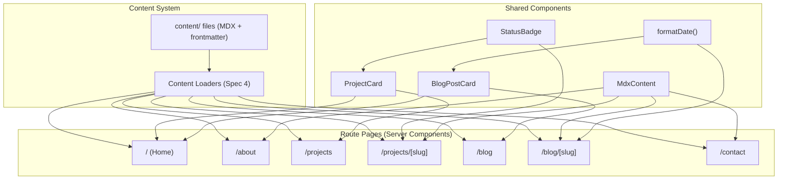

# Design Document: Core Content Pages

## Overview

This spec replaces the route stubs from Spec 5 with full page implementations that read all content from the content system. After implementation, the classic view is a functional professional website with seven routes: home, about, projects (index + detail), blog (index + detail), and contact.

Every page is a React Server Component that calls content loaders at render time. Shared presentational components (project card, blog post card, status badge, MDX content wrapper) eliminate duplication between home page sections and index pages. A shared date formatting utility ensures consistent `en-US` long-format dates across all blog-related views.

New seed content files fill gaps so every page has meaningful data: a `home` page entity, a `contact` page entity, and two additional blog posts (bringing the total to 3).

No new dependencies are required — `@tailwindcss/typography` is already installed and registered.

## Alignment with Steering

### Naming and Imports (structure.md)

- Components use PascalCase filenames: `ProjectCard.tsx`, `BlogPostCard.tsx`, `StatusBadge.tsx`, `MdxContent.tsx`
- Utility uses camelCase: `format.ts` (exports `formatDate`)
- Content files use kebab-case: `ai-engineering-lessons.mdx`, `type-safe-content.mdx`, `ml-pipeline-toolkit.mdx`
- All imports use `@/` alias for `src/` paths
- Content loaded via content loaders (`@/lib/content`), never raw file reads

### File Placement (structure.md)

- Shared components in `src/components/` — same directory as existing `Header.tsx`, `Footer.tsx`, `HeaderNav.tsx`, `SkipToContent.tsx`
- Utilities in `src/lib/` — `format.ts` alongside existing `content/` and `types/` directories
- Seed content in `content/pages/`, `content/blog/`, `content/projects/` — content is data, not code
- Route pages in `src/app/` following existing App Router structure from Spec 5

### Server/Client Boundaries (tech.md)

- All page components and shared components in this spec are React Server Components — no `'use client'` directive
- No client-side interactivity needed for content pages
- Content loaders are async functions called directly in server components
- `renderMDX` uses `next-mdx-remote/rsc` which is RSC-native

### Testing Conventions (learning log)

- Component tests use `// @vitest-environment jsdom` per-file directive
- Async server components tested via: `const el = await PageComponent(); render(el);`
- For components with params: `{ params: Promise.resolve({ slug: 'x' }) }`
- `renderMDX` mocked in component tests to avoid MDX compilation overhead
- ISO date generators use integer components (year/month/day), not `fc.date()` (per fast-check v4 gotcha)

### Existing Files Preserved

The following files from Spec 5 are modified in-place (not replaced):
- `src/app/page.tsx` — stub with hardcoded quickLinks → full content-driven home page
- `src/app/about/page.tsx` — already has basic MDX rendering → add metadata, MdxContent wrapper
- `src/app/projects/page.tsx` — basic list → ProjectCard grid
- `src/app/projects/[slug]/page.tsx` — basic MDX → full field display with optional sections
- `src/app/blog/page.tsx` — basic list → BlogPostCard list
- `src/app/blog/[slug]/page.tsx` — basic MDX → full field display with optional sections
- `src/app/contact/page.tsx` — already has basic MDX rendering → add metadata, MdxContent wrapper

These files already have working `generateStaticParams`, `generateMetadata`, and `notFound()` patterns from Spec 5. This spec extends them, not rewrites them.

### Metadata Centralization

The root layout (`src/app/layout.tsx`) already defines:
- Site name: `'Lorenzo Santucci'`
- Title template: `'%s — Lorenzo Santucci'` (via Next.js `metadata.title.template`)
- Default description: `'Freelance full-stack developer and ML/AI engineer'`
- `metadataBase` from `NEXT_PUBLIC_SITE_URL` env var

Pages that use `generateMetadata` only need to return `{ title, description }` — the template wrapping is handled by the layout. No need to duplicate the site name or separator in individual route files.

## File Map

| File | Action | Purpose |
|---|---|---|
| `src/lib/format.ts` | Create | Shared date formatting utility |
| `src/components/ProjectCard.tsx` | Create | Reusable project card component |
| `src/components/BlogPostCard.tsx` | Create | Reusable blog post card component |
| `src/components/StatusBadge.tsx` | Create | Status label for project status values |
| `src/components/MdxContent.tsx` | Create | Typography wrapper for rendered MDX |
| `src/app/page.tsx` | Modify | Home page with content-driven sections |
| `src/app/about/page.tsx` | Modify | About page with metadata from entity |
| `src/app/projects/page.tsx` | Modify | Projects index using ProjectCard |
| `src/app/projects/[slug]/page.tsx` | Modify | Project detail with full field display |
| `src/app/blog/page.tsx` | Modify | Blog index using BlogPostCard |
| `src/app/blog/[slug]/page.tsx` | Modify | Blog post detail with full field display |
| `src/app/contact/page.tsx` | Modify | Contact page with metadata from entity |
| `content/pages/home.mdx` | Create | Home page value proposition content |
| `content/pages/contact.mdx` | Create | Contact page content with email and links |
| `content/blog/ai-engineering-lessons.mdx` | Create | Second blog post seed |
| `content/blog/type-safe-content.mdx` | Create | Third blog post seed |
| `content/projects/ml-pipeline-toolkit.mdx` | Create | Second project seed |

## Architecture

### Data Flow



### Component Hierarchy

All pages are async React Server Components. They call content loaders directly (no client-side fetching). Shared components are pure presentational — they receive entity data as props and render it.

```
RootLayout (Spec 5)
├── Home Page
│   ├── Value proposition section (from Page slug "home" via MdxContent)
│   ├── Featured Projects section (ProjectCard × N)
│   ├── Latest Posts section (BlogPostCard × 3)
│   ├── CTA link to /contact
│   └── Play mode teaser (structural label)
├── About Page
│   └── MdxContent (from Page slug "about")
├── Projects Index
│   └── ProjectCard × N
├── Project Detail
│   ├── MdxContent
│   ├── StatusBadge
│   ├── Stack tags
│   ├── Links (conditional)
│   ├── Image (conditional)
│   └── Back navigation
├── Blog Index
│   └── BlogPostCard × N
├── Blog Post Detail
│   ├── MdxContent
│   ├── Date + tags
│   ├── Image (conditional)
│   └── Back navigation
└── Contact Page
    └── MdxContent (from Page slug "contact")
```

## Components and Interfaces

### `formatDate(isoDate: string): string`

Location: `src/lib/format.ts`

Formats an ISO date string to `en-US` long format (e.g., "July 1, 2025"). Uses `Intl.DateTimeFormat` with `{ year: 'numeric', month: 'long', day: 'numeric' }`. Extracted as a shared utility so blog index, blog detail, and home page all produce identical output.

### `MdxContent`

Location: `src/components/MdxContent.tsx`

Wraps a pre-rendered MDX JSX element in a `<div>` with Tailwind typography classes (`prose`). This is the single place where prose styling is applied to MDX output. All pages that render MDX content use this wrapper.

Props: accepts `children` (the JSX element returned by `renderMDX`).

MDX rendering error handling: `renderMDX` uses `next-mdx-remote/rsc` which compiles MDX during React Server Component rendering. In RSC, compilation errors during `await renderMDX(content)` may throw before the component can catch them — the error propagates to the nearest error boundary, not to a try/catch in the same async function.

**Preferred strategy**: wrap the `renderMDX` call in a helper that catches errors and returns a fallback JSX element. If try/catch works reliably in the RSC context, the page renders the entity's title and metadata normally, with only the MDX body replaced by a user-facing message (e.g., "Content could not be rendered"). The error is logged to the server console.

**Acceptable fallback**: if try/catch around `renderMDX` does not reliably catch all failure modes (known limitation with some RSC compilation errors), the fallback is Next.js's `error.tsx` boundary at the route segment level. The entity's title and metadata are rendered before the MDX call, so they survive in the error boundary's parent layout. This spec does not create new `error.tsx` files — it relies on Next.js's built-in error handling. If a route-level `error.tsx` is needed for better UX, it can be added in a future spec.

### `StatusBadge`

Location: `src/components/StatusBadge.tsx`

Accepts a project status value (`'completed' | 'in-progress' | 'ongoing'`) and renders a small label with visually distinct styling per status. Used by `ProjectCard` and the project detail page.

Display mapping:
- `completed` → "Completed" (green-tinted)
- `in-progress` → "In Progress" (amber-tinted)
- `ongoing` → "Ongoing" (blue-tinted)

### `ProjectCard`

Location: `src/components/ProjectCard.tsx`

Accepts a `Project` entity. Renders: title (as link to `/projects/{slug}`), description, stack tags (as inline labels), and status via `StatusBadge`. Used on the home page (featured projects) and the projects index.

### `BlogPostCard`

Location: `src/components/BlogPostCard.tsx`

Accepts a `BlogPost` entity. Renders: title (as link to `/blog/{slug}`), excerpt, formatted date (via `formatDate`), and tags (as inline labels). Used on the home page (latest posts) and the blog index.

### Page Implementations

#### Home Page (`src/app/page.tsx`)

Async server component. Calls `getPageBySlug('home')`, `getProjects()`, `getBlogPosts()`.

Sections (in order):
1. **Value proposition**: If `home` page entity exists, render its title as `<h1>` and content via `MdxContent`. If absent, omit entirely.
2. **Featured Projects**: Filter projects by `highlight === true`. If any exist, render section heading "Featured Projects" and a `ProjectCard` for each. If none, omit section.
3. **Latest Posts**: Take first 3 blog posts (already sorted by date desc from loader). If any exist, render section heading "Latest Posts" and a `BlogPostCard` for each. If none, omit section.
4. **CTA**: A link to `/contact` with structural label text.
5. **Play mode teaser**: A non-functional structural placeholder indicating the play view exists. Pure layout, no interaction.

Metadata: uses `generateMetadata` to read the `home` page entity. Title from entity title if available, otherwise falls back to the layout default. Description from entity `description` field if present, otherwise site default.

#### About Page (`src/app/about/page.tsx`)

Async server component. Calls `getPageBySlug('about')`.

Renders entity title as `<h1>` (fallback: "About"). Renders MDX content via `MdxContent`. If no entity found, shows fallback title with empty content area.

Metadata: `generateMetadata` reads the entity. Title from entity title (fallback: "About"). Description from entity `description` field if present, otherwise site default.

#### Projects Index (`src/app/projects/page.tsx`)

Async server component. Calls `getProjects()`.

Renders page heading "Projects" and a `ProjectCard` for each project. If no projects exist, renders an empty state message. Projects display in loader order (order asc, title asc).

Metadata: static — title "Projects".

#### Project Detail (`src/app/projects/[slug]/page.tsx`)

Async server component. Calls `getProjectBySlug(slug)`.

Renders: title as `<h1>`, `StatusBadge`, stack tags, MDX content via `MdxContent`, conditional links section (only if `links` has at least one defined value), conditional image (only if `image` field present), back navigation link to `/projects`.

`generateStaticParams`: calls `getProjects()` and maps to slug array.
`generateMetadata`: title from project title, description from project `description` field.
404: calls `notFound()` if no project matches.

#### Blog Index (`src/app/blog/page.tsx`)

Async server component. Calls `getBlogPosts()`.

Renders page heading "Blog" and a `BlogPostCard` for each post. If no posts exist, renders an empty state message. Posts display in loader order (date desc, title asc).

Metadata: static — title "Blog".

#### Blog Post Detail (`src/app/blog/[slug]/page.tsx`)

Async server component. Calls `getBlogPostBySlug(slug)`.

Renders: title as `<h1>`, formatted date (via `formatDate`), tags, MDX content via `MdxContent`, conditional image (only if `image` field present), back navigation link to `/blog`.

`generateStaticParams`: calls `getBlogPosts()` and maps to slug array.
`generateMetadata`: title from post title, description from post `excerpt` field.
404: calls `notFound()` if no post matches.

#### Contact Page (`src/app/contact/page.tsx`)

Async server component. Calls `getPageBySlug('contact')`.

Renders entity title as `<h1>` (fallback: "Contact"). Renders MDX content via `MdxContent`. If no entity found, shows fallback title with empty content area.

Metadata: `generateMetadata` reads the entity. Title from entity title (fallback: "Contact"). Description from entity `description` field if present, otherwise site default.

## Data Models

This spec introduces no new data models. All entity types are defined by Spec 2 and loaded by Spec 4.

### Entity Fields Used Per Page

| Page | Entity | Fields consumed |
|---|---|---|
| Home (value prop) | Page (`home`) | title, content, description? |
| Home (featured) | Project[] | title, slug, description, stack, status, highlight |
| Home (latest) | BlogPost[] | title, slug, excerpt, date, tags |
| About | Page (`about`) | title, content, description? |
| Projects index | Project[] | title, slug, description, stack, status |
| Project detail | Project | title, slug, description, content, stack, status, links?, image? |
| Blog index | BlogPost[] | title, slug, excerpt, date, tags |
| Blog post detail | BlogPost | title, slug, excerpt, content, date, tags, image? |
| Contact | Page (`contact`) | title, content, description? |

### Seed Content Summary

| File | Entity | Key fields |
|---|---|---|
| `content/pages/home.mdx` | Page | slug: `home`, title, description, content (value proposition) |
| `content/pages/contact.mdx` | Page | slug: `contact`, title, description, content (email + GitHub + LinkedIn) |
| `content/blog/ai-engineering-lessons.mdx` | BlogPost | distinct date, all required fields |
| `content/blog/type-safe-content.mdx` | BlogPost | distinct date, all required fields |
| `content/projects/ml-pipeline-toolkit.mdx` | Project | highlight: false, all required fields |

Existing content that remains valid:
- `content/pages/about.mdx` — already has title, slug, description, content
- `content/projects/personal-website.mdx` — highlight: true, order: 0
- `content/blog/hello-world.mdx` — first blog post


## Correctness Properties

*A property is a characteristic or behavior that should hold true across all valid executions of a system — essentially, a formal statement about what the system should do. Properties serve as the bridge between human-readable specifications and machine-verifiable correctness guarantees.*

### Property 1: Date formatting produces en-US long format

*For any* valid ISO date string (YYYY-MM-DD), `formatDate` shall produce a string in the format "Month D, YYYY" using the `en-US` locale (e.g., "2025-07-01" → "July 1, 2025").

**Validates: Requirements 5.5, 6.2**

### Property 2: ProjectCard renders all required fields and correct link

*For any* valid Project entity, the ProjectCard component shall render the project's title, description, each stack tag, a status label, and a link whose href is `/projects/{slug}`.

**Validates: Requirements 8.1, 3.2, 3.3, 1.9**

### Property 3: BlogPostCard renders all required fields and correct link

*For any* valid BlogPost entity, the BlogPostCard component shall render the post's title, excerpt, a formatted date string, each tag, and a link whose href is `/blog/{slug}`.

**Validates: Requirements 8.2, 5.2, 5.3, 1.10**

### Property 4: MdxContent wrapper applies prose typography classes

*For any* React children passed to the MdxContent wrapper, the outermost rendered element shall have the Tailwind `prose` class applied.

**Validates: Requirements 8.4, 11.1, 2.2, 4.2, 6.3, 7.2**

### Property 5: Home page featured section contains exactly the highlighted projects

*For any* list of projects returned by the content loader, the home page "Featured Projects" section shall contain a ProjectCard for each project where `highlight === true`, and no others. When no highlighted projects exist, the section is omitted entirely.

**Validates: Requirements 1.3, 1.4**

### Property 6: Home page latest section contains at most 3 posts

*For any* list of blog posts returned by the content loader (sorted by date descending), the home page "Latest Posts" section shall contain BlogPostCards for the first `min(3, posts.length)` posts. When no posts exist, the section is omitted entirely.

**Validates: Requirements 1.5, 1.6**

### Property 7: Content-backed pages display entity title

*For any* content entity (Page, Project, or BlogPost) rendered on its corresponding page, the page shall display the entity's `title` field as a heading. For Page entities (about, contact), if the entity is absent, the page displays the fallback title instead.

**Validates: Requirements 2.1, 4.1, 6.1, 7.1**

### Property 8: Dynamic route metadata includes entity title and summary

*For any* Project entity, `generateMetadata` on the project detail route shall return the project's `title` as page title and `description` as meta description. *For any* BlogPost entity, `generateMetadata` on the blog detail route shall return the post's `title` as page title and `excerpt` as meta description.

**Validates: Requirements 4.8, 6.7, 12.1, 12.2, 12.3**

### Property 9: generateStaticParams returns all known slugs

*For any* set of projects returned by `getProjects()`, the project detail route's `generateStaticParams` shall return an array containing every project slug. *For any* set of blog posts returned by `getBlogPosts()`, the blog detail route's `generateStaticParams` shall return an array containing every blog post slug.

**Validates: Requirements 4.7, 6.6**

### Property 10: Index pages preserve content loader sort order

*For any* ordered list of projects returned by the content loader, the projects index shall render ProjectCards in the same order. *For any* ordered list of blog posts returned by the content loader, the blog index shall render BlogPostCards in the same order.

**Validates: Requirements 3.4, 5.4**

### Property 11: Project detail conditionally displays optional fields

*For any* Project entity, if `links` has at least one defined value (live, github, or demo), the project detail page shall display those links; otherwise the links section is absent. If `image` is present, the page displays it; otherwise the image area is absent.

**Validates: Requirements 4.4, 4.5**

### Property 12: Blog post detail conditionally displays optional image

*For any* BlogPost entity, if `image` is present, the blog post detail page shall display it. If absent, the image area is absent from the rendered output.

**Validates: Requirements 6.4**

### Property 13: MDX render failure does not produce an unhandled exception

*For any* content entity whose MDX content causes a render failure, the system shall attempt to preserve the entity's title as a heading and not produce an unhandled exception. **Caveat**: this property is best-effort given RSC constraints. If try/catch around `renderMDX` works reliably, the page renders the title normally with a fallback message in place of the MDX body. If RSC compilation errors cannot be caught at the component level, the acceptable outcome is that Next.js's built-in error handling activates — the entity title and metadata survive in the parent layout. The task implementing this property should verify try/catch feasibility first and scope the test to whichever behavior the stack actually supports.

**Validates: Requirements 11.4**

### Property 14: Seed content passes loader validation

*For all* seed content files in the content directory, calling the corresponding content loader shall not throw a validation error.

**Validates: Requirements 9.7**

### Property 15: Seed content contains no placeholder text

*For all* seed content files, the file content shall not contain known placeholder patterns ("lorem ipsum", "TODO", "placeholder", "TBD").

**Validates: Requirements 9.6**

## Error Handling

### MDX Rendering Failures

`renderMDX` uses `next-mdx-remote/rsc` which compiles MDX during RSC rendering. Compilation errors may throw before the component can catch them — the error propagates to the nearest error boundary.

**Preferred strategy**: wrap the `renderMDX` call in a helper that catches errors and returns a fallback JSX element. If try/catch works reliably in the RSC context, the page renders the entity's title and metadata normally, with only the MDX body replaced by a user-facing message (e.g., "Content could not be rendered"). The error is logged to the server console.

**Acceptable fallback**: if try/catch does not reliably catch all failure modes (known limitation with some RSC compilation errors), the fallback is Next.js's built-in error handling. The entity's title and metadata are rendered before the MDX call, so they survive in the parent layout. This spec does not create new `error.tsx` files — if a route-level error boundary is needed for better UX, it can be added in a future spec.

### Missing Content Entities

| Scenario | Behavior |
|---|---|
| No Page for slug `home` | Home page omits value proposition section |
| No Page for slug `about` | About page shows fallback title "About", empty content |
| No Page for slug `contact` | Contact page shows fallback title "Contact", empty content |
| No Project for given slug | Project detail returns 404 via `notFound()` |
| No BlogPost for given slug | Blog post detail returns 404 via `notFound()` |
| No projects at all | Projects index shows empty state message |
| No blog posts at all | Blog index shows empty state message |
| No highlighted projects | Home page omits "Featured Projects" section |
| No blog posts | Home page omits "Latest Posts" section |

### Content Loader Errors

If a content loader throws (e.g., filesystem error, malformed frontmatter), the error propagates to Next.js's error boundary. This is existing behavior from Spec 4 — this spec does not add additional error handling at the loader level.

## Testing Strategy

### Property-Based Testing (PBT)

Library: `fast-check` (already available in the project).

PBT is used for properties where random input generation provides meaningful coverage — pure functions and components with varied entity data. Tests generate random entity data and verify the property holds across 100+ iterations.

Tag format for each test: `Feature: core-content-pages, Property {N}: {property title}`

Key generators needed:
- **Project generator**: random valid Project entities with all required fields, random optional fields (links, image, order), random highlight boolean
- **BlogPost generator**: random valid BlogPost entities with all required fields, random optional fields (image), random date strings
- **Page generator**: random valid Page entities with optional description
- **ISO date generator**: random valid YYYY-MM-DD strings (year 2000–2030, month 1–12, day 1–28)

Properties implemented as PBT:
- P1: formatDate (pure function, ideal for random date inputs)
- P2: ProjectCard rendering (random Project entities, check all fields rendered + correct link)
- P3: BlogPostCard rendering (random BlogPost entities, check all fields rendered + correct link)
- P4: MdxContent wrapper (random children, check prose class)
- P6: Latest posts slice (random post lists of varying length, check slice logic)
- P8: Dynamic route metadata (random entities, check generateMetadata output)
- P11: Project optional fields (random projects with/without links/image)
- P12: Blog post optional image (random posts with/without image)

### Unit / Integration Tests

The following properties are better covered by example-based unit tests or integration tests, because they involve page-level rendering with mocked loaders where randomization adds complexity without proportional value:

- **P5 (Featured projects filter)**: unit test with specific project lists — 0 highlighted, 1 highlighted, all highlighted. Randomization of full page rendering is heavy for a simple filter check.
- **P7 (Entity title display)**: unit tests per page — render with entity, render without entity (fallback). Fixed examples are clearer than random entities for testing fallback behavior.
- **P9 (generateStaticParams)**: unit test — mock loader, verify slug array. The function is a simple map, not worth PBT overhead.
- **P10 (Sort order preservation)**: unit test — render index with known ordered list, verify DOM order matches. Sort logic is tested in the content loader (Spec 4); here we just verify passthrough.
- **P13 (MDX render failure)**: integration test — mock `renderMDX` to throw, verify page still renders title. This is a single failure mode, not a property over random inputs.
- **P14 (Seed content validation)**: integration test — call real content loaders against actual seed files, verify no errors. Fixed input domain (the actual files).
- **P15 (No placeholder text)**: integration test — scan actual seed files for known placeholder patterns. Fixed input domain.

Additional unit tests (not tied to a numbered property):
- **StatusBadge**: parameterized test for all 3 status values — verify label text and visual distinction
- **Home page CTA**: verify link to `/contact` exists
- **Play mode teaser**: verify structural element exists, no interactive elements
- **404 behavior**: project detail and blog post detail with nonexistent slug call `notFound()`
- **Empty state messages**: projects index and blog index with empty content
- **Contact page seed**: verify MDX contains email and profile links

### Test Environment

- Component tests use `// @vitest-environment jsdom` per-file directive (per learning log decision)
- Content loader tests use Node environment
- `renderMDX` is mocked in component tests to avoid MDX compilation overhead — returns a simple JSX element
- Content loaders are mocked in page-level tests to control entity data

### Test File Organization

| Test file | Covers |
|---|---|
| `src/__tests__/lib/format.test.ts` | formatDate utility (P1 — PBT) |
| `src/__tests__/components/ProjectCard.test.tsx` | ProjectCard (P2 — PBT) |
| `src/__tests__/components/BlogPostCard.test.tsx` | BlogPostCard (P3 — PBT) |
| `src/__tests__/components/MdxContent.test.tsx` | MdxContent wrapper (P4 — PBT) |
| `src/__tests__/components/StatusBadge.test.tsx` | StatusBadge (unit, parameterized) |
| `src/__tests__/pages/home.test.tsx` | Home page (P5, P6 PBT, P7, CTA, teaser, missing entity) |
| `src/__tests__/pages/about.test.tsx` | About page (P7, fallback, metadata) |
| `src/__tests__/pages/projects-index.test.tsx` | Projects index (P10, empty state) |
| `src/__tests__/pages/project-detail.test.tsx` | Project detail (P8 PBT, P9, P11 PBT, P13, 404, back nav) |
| `src/__tests__/pages/blog-index.test.tsx` | Blog index (P10, empty state) |
| `src/__tests__/pages/blog-detail.test.tsx` | Blog post detail (P8 PBT, P9, P12 PBT, P13, 404, back nav) |
| `src/__tests__/pages/contact.test.tsx` | Contact page (P7, fallback, metadata) |
| `src/__tests__/content/seed-validation.test.ts` | Seed content audit (P14, P15, counts, highlighted project) |
