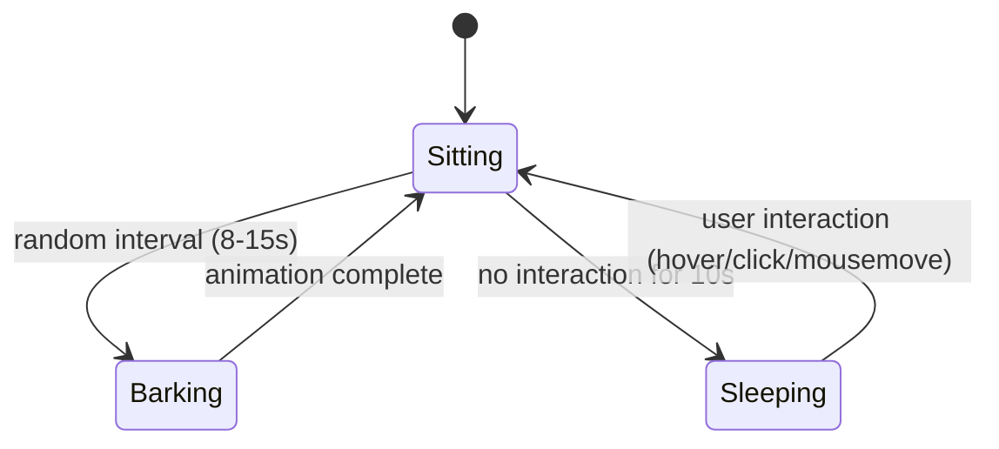

# Design Document: Design System Application

## Overview

This design applies the Spec 8 design system foundations to every page of the classic view. It replaces the current minimal-styling pages (gray borders, system-font-like Tailwind defaults, card grids) with the approved Figma designs: RPG title screen landing page, collection-based indexes, two-column detail pages with metadata panels, and a shared page structure (Header, page title, CTA banner, cross-links, Footer) that ties every inner page together.

The scope covers three categories of work:

1. **Shared page structure**: Header with MENU trigger, Menu Overlay, Footer, and the vertical section pattern (page title → content → CTA → cross-links) applied to all inner pages. The root layout is restructured so the landing page opts out of Header/CTA/cross-links while inner pages inherit them.
2. **Page redesigns**: Each page is rebuilt using Spec 8 base components (Button, Badge, CollectionContainer, CollectionRow, CTABanner, CrossLinks, Prose, RPGSelector, StatBar, PixelImage, Blockquote, SectionLabel) and design tokens. New page-level components are created where needed (TottiSprite, LandingMenu, MenuOverlay, ChatSection, ProjectCard, ProjectMetadataPanel, AgentProfileSidebar).
3. **Data model extension**: The Agent interface gains new fields (`index`, `mission`, `bestFor`, `toneOfVoice`, `greeting`), existing agent YAML files are updated, and the agent content loader validates the new required fields.

Four components are deprecated and removed: `AgentCard`, `BlogPostCard`, `ProjectCard` (old), `StatusBadge`. Their functionality is replaced by CollectionRow-based patterns (blog, agentdex indexes) and a new design-system-native ProjectCard (projects index).

Priority tiers: R6 (Totti sprite animation state machine) and R20 (micro-interactions) are marked Polish. The site is shippable with only Core requirements.

## Architecture

### Layout Strategy

The current root layout (`src/app/layout.tsx`) renders Header and Footer on every page, including the landing page. This must change: the landing page has no Header, no CTA banner, and no cross-links. The Footer appears on all pages.

The approach: move Header rendering out of the root layout and into a shared `InnerPageLayout` wrapper component. The root layout provides only the HTML shell (fonts, body, SkipToContent, Footer). Each inner page imports `InnerPageLayout` which renders Header → page title → content → CTA → cross-links. The landing page renders its own unique structure directly.

```
Root Layout (layout.tsx)
├── <html> with font variables
├── <body>
│   ├── SkipToContent
│   ├── <main id="main-content">
│   │   └── {children}  ← page content
│   └── Footer
└── </body>

Inner pages use InnerPageLayout:
  InnerPageLayout
  ├── Header
  ├── Page title (Pixbob Bold, page-title size)
  ├── Page content (max-w-content-max, centered)
  ├── CTABanner
  ├── CrossLinks
  └── (Footer is in root layout, below)

Landing page:
  Direct render — no InnerPageLayout
  ├── Title + subtitle (centered)
  ├── Two-column: TottiSprite | LandingMenu
  └── (Footer is in root layout, below)
```

### Component Hierarchy

```
src/components/
├── ui/                          # Spec 8 base components (unchanged)
│   ├── ArrowUpRight.tsx
│   ├── Badge.tsx
│   ├── Blockquote.tsx
│   ├── Button.tsx
│   ├── CollectionContainer.tsx
│   ├── CollectionRow.tsx
│   ├── CrossLinks.tsx
│   ├── CTABanner.tsx
│   ├── PixelImage.tsx
│   ├── Prose.tsx
│   ├── RPGSelector.tsx
│   ├── SectionLabel.tsx
│   └── StatBar.tsx
├── Header.tsx                   # Redesigned: logo + MENU trigger
├── Footer.tsx                   # Redesigned: copyright + social + CTA
├── InnerPageLayout.tsx          # NEW: shared vertical structure
├── MenuOverlay.tsx              # NEW: full-screen nav overlay ('use client')
├── TottiSprite.tsx              # NEW: animated sprite ('use client', Polish)
├── LandingMenu.tsx              # NEW: RPG-style nav menu
├── ChatSection.tsx              # NEW: visual placeholder (replaces ChatPlaceholder)
├── ProjectCard.tsx              # REPLACED: new design-system-native card
├── ProjectMetadataPanel.tsx     # NEW: right-column metadata for project detail
├── Breadcrumb.tsx               # NEW: shared breadcrumb component
├── SkipToContent.tsx            # Existing (unchanged)
├── MdxContent.tsx               # Existing (may be replaced by Prose usage)
└── [DEPRECATED — to remove]
    ├── AgentCard.tsx
    ├── BlogPostCard.tsx
    ├── HeaderNav.tsx
    └── StatusBadge.tsx
```

### State Management

Three components require client-side state:

1. **Header** (`'use client'`): owns the menu open/close state (`useState`) and passes `isOpen`/`onClose` to MenuOverlay, plus a `triggerRef` for focus return. This is the only state Header manages.

2. **MenuOverlay** (`'use client'`): receives `isOpen`, `onClose`, and `triggerRef` as props. Focus trapping via a `useEffect` that captures Tab/Shift+Tab and Escape. Communicates open/closed to assistive technologies via `aria-modal`, `role="dialog"`, and `aria-hidden` on the underlying page content.

3. **TottiSprite** (`'use client'`, Polish): manages animation state machine (sitting/barking/sleeping) via `useState` + `useRef` for timers. Uses `requestAnimationFrame` or CSS `steps()` animation for sprite frame cycling. Listens for `prefers-reduced-motion` via `matchMedia`. No external state library — component-local state only.

All other components are React Server Components. InnerPageLayout is a server component that renders Header (a client component) — this is valid in Next.js App Router, where server components can render client components as children. Page data flows from content loaders (async server functions) directly into page components, which pass props to child components. No Zustand involvement in this spec — Zustand is reserved for Phaser↔React communication in the play view.

### Responsive Strategy

Mobile-first implementation. All layouts start as single-column and layer on multi-column at breakpoints:

| Breakpoint | Token | Behavior |
|---|---|---|
| Default (< 640px) | — | Single column. Page padding `px-6`. Reduced font sizes. |
| `md` (≥ 768px) | — | Two-column layouts begin (projects grid, collection rows horizontal). Page padding `md:px-12`. |
| `lg` (≥ 1024px) | — | Full two-column pages (about, agent profile, project detail). |
| `xl` (≥ 1280px) | — | Exact Figma token values via `xl:px-page-px`, `xl:gap-section-gap`, etc. |
| Max width | `max-w-content-max` | Content capped at 1312px, centered with `mx-auto`. |

All spacing references use the responsive pattern established in Spec 8: standard Tailwind scale at small breakpoints, theme tokens at `xl`. No hardcoded pixel values in page components — only in `globals.css` where tokens are defined, and the permitted exceptions from Spec 8 (xl typography, SVG dimensions, PixelImage computed dimensions).

## Components and Interfaces

### InnerPageLayout

Shared wrapper for all inner pages. Renders the consistent vertical structure.

```typescript
interface InnerPageLayoutProps {
  title: string;
  ctaHeadline: string;
  ctaBody: string;
  crossLinkSections: [CrossLinkSection, CrossLinkSection];
  children: React.ReactNode;
}
```

- Renders: Header → `<h1>` (page title in Pixbob Bold at page-title size) → `{children}` (page content, constrained to `max-w-content-max`) → CTABanner (linking to `/contact`) → CrossLinks → (Footer is in root layout)
- All vertical sections separated by `section-gap` token
- Server component (no client state)

### Header (Redesigned)

Replaces the current Header + HeaderNav with a minimal logo + MENU trigger.

Header is a client component (`'use client'`) because it manages the menu overlay open/close state via `useState` and passes it to MenuOverlay.

- Left: "Lorenzo Santucci" as a link to `/`, using `font-pixbob-bold` at logo size, `text-text` color
- Right: "MENU" text using `font-pixbob-lite` at logo size, `text-text` color. Acts as a button (`<button>`) that opens the MenuOverlay
- Full container width, items justified between, padding from page tokens
- The MENU trigger has `aria-label="Open navigation menu"` and `aria-expanded` reflecting overlay state
- Does NOT appear on the landing page (InnerPageLayout renders it; landing page doesn't use InnerPageLayout)

### MenuOverlay

Full-screen navigation overlay. Client component.

```typescript
interface MenuOverlayProps {
  isOpen: boolean;
  onClose: () => void;
  triggerRef: React.RefObject<HTMLButtonElement | null>;
}
```

- When `isOpen`: renders a full-viewport overlay (`fixed inset-0 z-50`) with `bg-surface`
- Navigation links: About, Projects, Agentdex, Blog, Contact — each as a list item with pixel-art typography (`font-pixbob-regular`), RPG-style presentation
- Close control: a button with `aria-label="Close navigation menu"`
- Escape key closes the overlay
- Focus trap: Tab/Shift+Tab cycle within overlay interactive elements only
- On close: focus returns to `triggerRef.current` (the MENU button)
- ARIA: `role="dialog"`, `aria-modal="true"`, `aria-label="Navigation menu"`
- Transition: instant open/close (no animation, or a fast fade ≤200ms if Polish is implemented)

### Footer (Redesigned)

Replaces the current minimal footer.

- Left section: copyright text ("© Lorenzo Santucci {year}") in `font-pixbob-lite`, LinkedIn icon link, GitHub icon link
- Right section: "contact me" Button (primary variant, linking to `/contact`)
- LinkedIn: `https://linkedin.com/in/lorenzosantucci`, `target="_blank" rel="noopener noreferrer"`, `aria-label="LinkedIn"`
- GitHub: `https://github.com/lollo-santucci`, `target="_blank" rel="noopener noreferrer"`, `aria-label="GitHub"`
- Social icons: inline SVG or pixel-art icon components, minimum 44×44px touch target
- Desktop: horizontal layout, items justified between
- Mobile (< 768px): stacks vertically, centered
- Server component (year computed at render time via `new Date().getFullYear()`)

### Breadcrumb

Shared breadcrumb component used on detail pages (blog post, agent profile, project detail).

```typescript
interface BreadcrumbProps {
  items: Array<{ label: string; href: string }>;
  current: string;
}
```

- Renders inside a `<nav aria-label="Breadcrumb">`
- Items are links in `font-pixbob-regular`, muted color, with arrow separator
- Current page name displayed as non-linked text
- Server component

### LandingMenu

RPG-style navigation menu for the landing page.

- Renders a `<nav>` with `<ul>` of menu items
- Items: "New Game" (disabled), "> About", "> Projects", "> Agentdex", "> Blog"
- Each active item: `<li>` containing a `<a>` with RPGSelector prefix (`>`), `font-pixbob-regular` at menu item size
- "New Game": rendered as `<li>` with `aria-disabled="true"`, `tabIndex={-1}`, visually muted (`text-text-muted`), not clickable
- Active items display Focus_Treatment on keyboard focus
- Keyboard navigable: Tab between items, Enter to activate
- Server component (no client state — links are standard `<a>` elements)

### TottiSprite (Polish — R6)

Animated pixel-art sprite of the companion dog Totti on the landing page. Client component.

**Spritesheets:** Three spritesheets for the three states: `BROWN_DOG_SITTING.png`, `BROWN_DOG_PLAYFUL.png`, `BROWN_DOG_SLEEPING.png`. Each uses 32×32 frames. Exact grid dimensions and frame parsing are implementation details — reference the Figma/asset files during task implementation.

**State machine:**



**Implementation approach:**
- CSS `background-position` sprite animation using `@keyframes` + `steps()` for frame cycling
- Component manages current state via `useState<'sitting' | 'barking' | 'sleeping'>`
- `useRef` for inactivity timer and bark interval timer
- `useEffect` for setting up/tearing down timers and event listeners
- Frame rate: ~4-6 FPS (pixel-art feel) via `animation-duration` calculation
- Display size: fluid, using responsive classes. Desktop reference ~490×418px, scales down on mobile via `max-w-[60vw]` or similar
- `image-rendering: pixelated` via the `.pixel-art` CSS class
- `prefers-reduced-motion: reduce` → display a static front-facing frame, no animation
- All spritesheet paths, frame counts, timing values defined as constants at the top of the file

**Fallback (if Polish is deferred):** render a static front-facing frame from `BROWN_DOG_SITTING.png` using PixelImage component. No animation, no state machine. The landing page still shows Totti, just without movement.

### ChatSection

Visual placeholder for the chat interface on the agent profile page. Replaces the old `ChatPlaceholder` component.

```typescript
interface ChatSectionProps {
  agentName: string;
  greeting?: string;
}
```

- Greeting area: bordered box displaying `{agentName}: {greeting}` or default `"Hi! I'm {agentName}. Chat coming soon."` in `font-pixbob-regular`
- Input area: text input with `border-standard border-black`, placeholder text "You:", `font-pixbob-regular`
- Send button: Button component (primary variant) with `aria-disabled="true"`, `aria-label="Send message — coming soon"`. Focusable but non-functional.
- No API calls, no navigation, no functional behavior on type or submit
- SectionLabel "chat" (accent variant) above the section
- Server component (no interactivity — the input is visual only, the button is aria-disabled)

### ProjectCard (New)

Replaces the deprecated `ProjectCard`. Design-system-native project card for the projects index grid.

```typescript
interface ProjectCardProps {
  project: Project;
}
```

- Screenshot area: project image (if available) with `border-frame border-black` + Offset_Shadow as defined in the glossary. If no image, a placeholder background (`bg-surface` with border).
- Tech badges: positioned on the screenshot area, stacked vertically. Each badge uses the Badge component.
- Below screenshot: project title in `font-pixbob-bold` at project-title size with ArrowUpRight icon, one-line description in `font-pixbob-regular`
- Entire card is a link to `/projects/{slug}`
- Server component

### ProjectMetadataPanel

Right-column metadata panel for the project detail page.

```typescript
interface ProjectMetadataPanelProps {
  integrations?: Array<{ name: string; category: string }>;
  stack: string[];
  metrics?: Array<{ label: string; value: string }>;
  liveUrl?: string;
}
```

- Sections: Integrations (SectionLabel dark), Tech Stack (SectionLabel accent), Stats (SectionLabel dark)
- Each section: label badge + list of items with RPGSelector prefix and optional colored badges
- Launch button: Button (primary variant) linking to live URL, full width. Omitted if no `liveUrl`.
- Server component

### Page-Level Design Decisions

#### Landing Page (`/`)

- No Header, no CTA banner, no cross-links. Footer only.
- Title: "Lorenzo Santucci" centered, `font-pixbob-bold` at page-title size
- Subtitle: "FULL STACK DEVELOPER & AI ENGINEER" centered, `font-pixbob-lite`
- Two-column layout (desktop ≥ 768px): TottiSprite left, LandingMenu right
- Mobile (< 768px): stacks vertically — title → subtitle → TottiSprite → LandingMenu. Page scrolls.
- Desktop (≥ 1024px): fills viewport height (`min-h-screen`) without scrolling
- Metadata: `<title>` is "Lorenzo Santucci" (no suffix, uses `title.default` from root layout)
- Canonical URL: `/`

#### About Page (`/about`)

- Shared page structure via InnerPageLayout
- Two-column layout (desktop ≥ 1024px): left = prose content via Prose component, right = profile sidebar
- Profile sidebar: styled as an agentdex-style card with character sprite (PixelImage), role, best-for list, mission box, tone-of-voice StatBarGroup, and contact CTA button. Uses pixel-art typography for labels (SectionLabel components).
- The sidebar data (role, bestFor, mission, toneOfVoice) comes from the Lorenzo agent entity (`content/agents/lorenzo-santucci.yaml`) loaded via `getAgentBySlug('lorenzo-santucci')`.

> **Key Design Decision — About sidebar ↔ Agent coupling:** Lorenzo IS an agent in the agentdex (agent 001). The about page sidebar is intentionally an agentdex-style profile card because it previews his agent profile. Using the same data source ensures consistency — if Lorenzo's agent data changes, the about sidebar updates automatically. Content dependency: `content/agents/lorenzo-santucci.yaml` must exist with Agent_Extended_Fields for the sidebar to be fully populated. Fallback: if `getAgentBySlug('lorenzo-santucci')` returns null, the sidebar renders without agent-specific data (role, bestFor, mission, toneOfVoice are omitted). The prose content still displays — graceful degradation, not an error.

- Mobile (< 1024px): stacks vertically — prose above, sidebar below
- Content loaded from Page entity with slug `about`. Fallback title: "About"
- CTA: "Have a project in mind?" / "Let's talk about how to turn it into something clear, useful and well built."
- Cross-links: Blog + Projects

#### Blog Index (`/blog`)

- Shared page structure via InnerPageLayout
- All posts inside CollectionContainer
- Each post as CollectionRow: formatted date (DD.MM.YYYY) in muted color, RPGSelector prefix, post title, optional "New" Badge (accent, for posts within last 30 days), "Read" Button (secondary, linking to `/blog/{slug}`)
- Posts sorted date-descending (existing `compareBlogPosts` handles this)
- Empty state: a message inside the collection area
- Date formatting: a new `formatDateDDMMYYYY` function in `src/lib/format.ts` that produces `DD.MM.YYYY` format
- "New" badge logic: compare post date to current date, show badge if within 30 days. Pure function in `src/lib/format.ts`: `isRecentPost(date: string, thresholdDays?: number): boolean`
- CTA: "Read something interesting?" / "Let's discuss it!"
- Cross-links: Agentdex + Projects

#### Blog Post Detail (`/blog/[slug]`)

- Shared page structure via InnerPageLayout
- Breadcrumb: "Blog" → post title
- Title in page-title size
- Metadata row: formatted date (DD.MM.YYYY), estimated read time, category/tag badges
- Read time: calculated from word count. Pure function in `src/lib/format.ts`: `calculateReadTime(content: string, wordsPerMinute?: number): number`. Default 200 WPM. Returns minutes rounded up.
- Body: rendered via Prose component, max width ~720px (`max-w-prose` or a custom constraint)
- Static generation via `generateStaticParams` (existing pattern)
- 404 for unknown slugs via `notFound()`
- CTA: "Read something interesting?" / "Let's discuss it!"
- Cross-links: Agentdex + Projects

#### Agentdex Index (`/agentdex`)

- Shared page structure via InnerPageLayout
- All agents inside CollectionContainer
- Each agent as CollectionRow: pixel portrait (PixelImage, small crop from spritesheet — front-facing frame, column 3 row 0 of 32×64 grid, displayed at small scale), index number formatted as 3 digits (`String(agent.index).padStart(3, '0')`) in muted color, RPGSelector prefix, agent name, optional Badge for status, "Meet" Button (secondary, linking to `/agentdex/{slug}`)
- Agents sorted by `index` field ascending. New sort function in `src/lib/content/agent-utils.ts`: `sortAgentsByIndex(agents: Agent[]): Agent[]`
- Empty state message
- CTA: "Want to build an Agent?" / "Hire me!"
- Cross-links: Blog + Projects

#### Agent Profile (`/agentdex/[slug]`)

- Shared page structure via InnerPageLayout
- Breadcrumb: "Agentdex" → agent name
- Agent name in page-title size, index number adjacent in muted/reduced opacity
- Two-column layout (desktop ≥ 1024px): left = large character sprite (PixelImage, front-facing frame at larger scale than index portrait), right = metadata sections
- Right column sections:
  - Role: SectionLabel (dark) + RPGSelector + role text
  - Best for: SectionLabel (dark) + list with RPGSelector prefix per item
  - Mission: SectionLabel (blue) + bordered box with mission text in `font-pixbob-regular`
  - Tone of Voice: SectionLabel (lime) + StatBarGroup with 5 StatBars
- Below two columns: ChatSection
- Mobile (< 1024px): sprite above, metadata below
- Static generation + 404 pattern
- CTA: "Want to build an Agent?" / "Hire me!"
- Cross-links: Blog + Projects

#### Projects Index (`/projects`)

- Shared page structure via InnerPageLayout
- Two-column grid on desktop (≥ 768px), single column on mobile
- Each project rendered via the new ProjectCard component
- Empty state message
- CTA: "Have a project in mind?" / "Let's talk about how to turn it into something clear, useful and well built."
- Cross-links: Agentdex + Blog

#### Project Detail (`/projects/[slug]`)

- Shared page structure via InnerPageLayout
- Breadcrumb: "Projects" → project title
- Hero area: screenshot with border-frame + project title + tech badges
- Two-column layout (desktop ≥ 1024px): left = prose content via Prose, right = ProjectMetadataPanel
- Mobile (< 1024px): prose above, metadata below
- Static generation + 404 pattern
- CTA: "Have a project in mind?" / "Let's talk about how to turn it into something clear, useful and well built."
- Cross-links: Agentdex + Blog

#### Contact Page (`/contact`)

- Shared page structure via InnerPageLayout
- Content loaded from Page entity with slug `contact`. Fallback title: "Contact"
- Contact methods: email link, LinkedIn link, GitHub link. All external links open in new tab.
- Minimum 44×44px touch targets on mobile
- CTA: "Have a project in mind?" / "Let's talk about how to turn it into something clear, useful and well built."
- Cross-links: Blog + Projects

## Data Models

### Agent Interface Extension

The current `Agent` interface (from `src/lib/types/agent.ts`) must be extended with the fields required for the full agent profile page:

```typescript
export interface Agent {
  // Existing fields (unchanged)
  name: string;
  slug: Slug;
  role: string;
  personality: string;
  capabilities: string[];
  status: 'active' | 'coming-soon' | 'experimental';
  portrait?: AssetPath;
  world?: { /* unchanged */ };
  software?: { /* unchanged */ };

  // New required fields (R17)
  index: number;
  mission: string;
  bestFor: string[];
  toneOfVoice: {
    warm: number;
    direct: number;
    playful: number;
    formal: number;
    calm: number;
  };

  // New optional field (R17)
  greeting?: string;
}
```

### Agent Content Loader Updates

The agent content loader (`src/lib/content/agents.ts`) must update its validation config:

- `VALIDATION.requiredFields`: add `'index'`, `'mission'`, `'bestFor'`, `'toneOfVoice'`
- `VALIDATION.arrayFields`: add `'bestFor'`

### Utility Functions

New pure functions added to `src/lib/format.ts`:

| Function | Signature | Purpose |
|---|---|---|
| `formatDateDDMMYYYY` | `(isoDate: string) => string` | Formats ISO date as `DD.MM.YYYY` for collection rows and metadata |
| `isRecentPost` | `(isoDate: string, thresholdDays?: number) => boolean` | Returns true if date is within `thresholdDays` (default 30) of now |
| `calculateReadTime` | `(content: string, wordsPerMinute?: number) => number` | Estimates read time in minutes (rounded up). Default 200 WPM. |
| `formatAgentIndex` | `(index: number) => string` | Formats agent index as 3-digit string (e.g., 1 → "001") |

New function in `src/lib/content/agent-utils.ts`:

| Function | Signature | Purpose |
|---|---|---|
| `sortAgentsByIndex` | `(agents: Agent[]) => Agent[]` | Returns agents sorted by `index` ascending. Does not mutate input. |

### Root Layout Changes

The root layout (`src/app/layout.tsx`) is modified:

- Remove `Header` import and rendering from the layout body
- Remove the `max-w-4xl` constraint from `<main>` (each page controls its own max width via InnerPageLayout or direct styling)
- Keep: font loading, metadata, SkipToContent, Footer, `<main id="main-content">`
- The `<main>` element wraps `{children}` with minimal styling (`flex-grow`)

### Metadata Strategy

| Page | Title Pattern | Description Source |
|---|---|---|
| Landing (`/`) | "Lorenzo Santucci" (default, no suffix) | Static default description |
| About | "About \| Lorenzo Santucci" | Page entity description |
| Blog index | "Blog \| Lorenzo Santucci" | Static |
| Blog post | "{title} \| Lorenzo Santucci" | `post.excerpt` |
| Agentdex index | "Agentdex \| Lorenzo Santucci" | Static |
| Agent profile | "{name} \| Lorenzo Santucci" | `agent.role` + `agent.mission` |
| Projects index | "Projects \| Lorenzo Santucci" | Static |
| Project detail | "{title} \| Lorenzo Santucci" | `project.description` |
| Contact | "Contact \| Lorenzo Santucci" | Page entity description |

The root layout's `title.template` is `%s — Lorenzo Santucci`. Inner pages export `title` as a string (the template adds the suffix). The landing page uses `title.default` which is "Lorenzo Santucci" with no suffix.

Note: the template separator in the existing root layout is ` — ` (em dash). The requirements specify ` | ` (pipe). The design follows the requirements: update the template to `'%s | Lorenzo Santucci'`.

All pages include `alternates: { canonical: '/{path}' }`.

### Cross-Links Configuration

Each inner page specifies which two sections appear in its cross-links. This is a design decision per page:

| Page | Cross-Link 1 | Cross-Link 2 |
|---|---|---|
| About | Blog | Projects |
| Blog index | Agentdex | Projects |
| Blog post | Agentdex | Projects |
| Agentdex index | Blog | Projects |
| Agent profile | Blog | Projects |
| Projects index | Agentdex | Blog |
| Project detail | Agentdex | Blog |
| Contact | Blog | Projects |

Cross-link items are dynamic: they show the latest/first content items from the linked section (e.g., latest blog post title, first project title). Loaded via content loaders at render time.

### Component Deprecation Plan

| Component | Replaced By | Action |
|---|---|---|
| `src/components/AgentCard.tsx` | CollectionRow in agentdex index | Delete file |
| `src/components/BlogPostCard.tsx` | CollectionRow in blog index | Delete file |
| `src/components/ProjectCard.tsx` | New `ProjectCard.tsx` (same path, new implementation) | Replace in-place |
| `src/components/StatusBadge.tsx` | Badge component from Spec 8 | Delete file |
| `src/components/HeaderNav.tsx` | MenuOverlay | Delete file |
| `src/components/ChatPlaceholder.tsx` | ChatSection | Delete file |

### File Map

| Action | Path |
|---|---|
| Modify | `src/lib/types/agent.ts` |
| Modify | `src/lib/content/agents.ts` |
| Modify | `src/lib/content/agent-utils.ts` |
| Modify | `src/lib/format.ts` |
| Modify | `src/app/layout.tsx` |
| Modify | `src/app/page.tsx` |
| Modify | `src/app/about/page.tsx` |
| Modify | `src/app/blog/page.tsx` |
| Modify | `src/app/blog/[slug]/page.tsx` |
| Modify | `src/app/agentdex/page.tsx` |
| Modify | `src/app/agentdex/[slug]/page.tsx` |
| Modify | `src/app/projects/page.tsx` |
| Modify | `src/app/projects/[slug]/page.tsx` |
| Modify | `src/app/contact/page.tsx` |
| Create | `src/components/InnerPageLayout.tsx` |
| Create | `src/components/MenuOverlay.tsx` |
| Create | `src/components/TottiSprite.tsx` |
| Create | `src/components/LandingMenu.tsx` |
| Create | `src/components/ChatSection.tsx` |
| Create | `src/components/Breadcrumb.tsx` |
| Create | `src/components/ProjectMetadataPanel.tsx` |
| Modify | `src/components/Header.tsx` |
| Modify | `src/components/Footer.tsx` |
| Replace | `src/components/ProjectCard.tsx` |
| Delete | `src/components/AgentCard.tsx` |
| Delete | `src/components/BlogPostCard.tsx` |
| Delete | `src/components/StatusBadge.tsx` |
| Delete | `src/components/HeaderNav.tsx` |
| Delete | `src/components/ChatPlaceholder.tsx` |
| Modify | `content/agents/sales-agent.yaml` |
| Modify | `content/agents/code-review-agent.yaml` |
| Create | `content/agents/lorenzo-santucci.yaml` |

### Alignment with Steering

- **Naming**: all file names kebab-case, components PascalCase, utilities camelCase per `structure.md`
- **Imports**: `@/` alias for `src/` imports. Content loaded via content loaders, not raw file reads.
- **File placement**: page-level components in `src/components/`, base UI in `src/components/ui/` (unchanged). Utilities in `src/lib/`. Content in `content/`.
- **Server/client boundary**: Header, MenuOverlay, and TottiSprite are client components. All other new components are server components. InnerPageLayout (server) renders Header (client) — valid in Next.js App Router.
- **Testing**: Vitest with per-file `// @vitest-environment jsdom` for component tests. `fast-check` for PBT.
- **Content system**: agent data loaded via `getAgentBySlug`, not raw YAML reads. Slug is the link between content and assets.
- **Glossary compliance**: "Agentdex" (not "agent list"), "agent profile" (not "agent card" for detail page), "companion" for Totti (not "pet"), "classic view" (not "website mode").
- **No hardcoded pixels in page components**: all spacing/sizing from design tokens. Permitted exceptions per Spec 8 convention.
- **External links**: `target="_blank" rel="noopener noreferrer"` on all external hrefs (LinkedIn, GitHub).
- **GitHub handle**: `lollo-santucci` (not `lorenzosantucci`).

## Correctness Properties

*A property is a characteristic or behavior that should hold true across all valid executions of a system — essentially, a formal statement about what the system should do. Properties serve as the bridge between human-readable specifications and machine-verifiable correctness guarantees.*

### Property 1: Date formatting round trip produces DD.MM.YYYY

*For any* valid ISO date string (YYYY-MM-DD), `formatDateDDMMYYYY` shall produce a string matching the pattern `DD.MM.YYYY` where DD is 01–31, MM is 01–12, and YYYY is the four-digit year from the input.

**Validates: Requirements 9.3, 10.4**

### Property 2: Read time is always a positive integer

*For any* non-empty string, `calculateReadTime` shall return a positive integer (≥ 1). For the empty string, it shall return 1 (minimum read time).

**Validates: Requirements 10.4**

### Property 3: Agent index formatting produces zero-padded 3-digit string

*For any* integer `n` where `0 ≤ n ≤ 999`, `formatAgentIndex(n)` shall produce a string of exactly 3 characters, consisting only of digits, whose numeric value equals `n`.

**Validates: Requirements 11.3**

### Property 4: Agent sort by index is monotonically non-decreasing

*For any* array of agents with distinct `index` values, `sortAgentsByIndex` shall return an array where each agent's `index` is less than or equal to the next agent's `index`.

**Validates: Requirements 11.4**

### Property 5: ChatSection displays greeting or default with agent name

*For any* agent name string and optional greeting string, the ChatSection component shall render text containing either the provided greeting (when present) or a default message that includes the agent name (when greeting is absent).

**Validates: Requirements 13.1**

### Property 6: Project card links to correct slug path

*For any* project with a slug, the rendered ProjectCard shall contain a link with `href` equal to `/projects/{slug}`.

**Validates: Requirements 14.5**

### Property 7: Agent loader rejects data missing required fields

*For any* agent data object that is missing one or more of the required fields (`name`, `slug`, `role`, `personality`, `capabilities`, `status`, `index`, `mission`, `bestFor`, `toneOfVoice`), the agent content loader shall throw an error during validation.

**Validates: Requirements 17.4**

### Unit Test Check 8: No TODO or lorem ipsum in seed content

*For each* content file in the `content/` directory (excluding templates), the file content shall not contain the strings "TODO", "lorem ipsum", or "Lorem Ipsum" (case-insensitive for lorem ipsum).

Note: this is a file scan over a fixed set of content files, not a PBT. Implemented as a parameterized unit test.

**Validates: Requirements 18.5**

### Property 9: No hardcoded pixel values in page components

*For any* page component file in `src/app/**/*.tsx`, the file content shall not contain hardcoded pixel values in className strings (patterns like `px-[100px]`, `w-[500px]`, `gap-[20px]`). Permitted exceptions: Tailwind arbitrary values at responsive breakpoints for typographic sizes (e.g., `xl:text-[128px]`), SVG intrinsic dimensions, and PixelImage computed dimensions — consistent with Spec 8 Property 1.

Note: this is a file scan over a fixed set of page files, not a PBT. Implemented as a parameterized unit test.

**Validates: Requirements 21.6**

### Unit Test Check 10: All rendered images have non-empty alt text

*For each* page that renders images (sprites, screenshots, portraits), every `` element in the rendered output shall have a non-empty `alt` attribute.

Note: this is a unit test per page over a fixed set of pages, not a PBT.

**Validates: Requirements 23.2**

### Property 11: Totti state machine transitions (Polish)

*For any* valid state (`sitting`, `barking`, `sleeping`) and event (`bark_timer`, `inactivity_timeout`, `bark_complete`, `user_interaction`), the Totti sprite state machine shall produce the correct next state according to the transition table:
- (sitting, bark_timer) → barking
- (sitting, inactivity_timeout) → sleeping
- (barking, bark_complete) → sitting
- (sleeping, user_interaction) → sitting
- All other (state, event) pairs → same state (no transition)

**Validates: Requirements 6.2**

### Property 12: isRecentPost threshold check

*For any* ISO date string and positive threshold in days, `isRecentPost` shall return `true` if and only if the date is within `thresholdDays` of the current date (inclusive).

**Validates: Requirements 9.3**

## Error Handling

### Content Loading Failures

- **Missing page content** (about, contact): pages display a Fallback_Title ("About", "Contact") with an empty content area. No error thrown — graceful degradation.
- **Missing entity for detail pages** (blog post, agent, project): `notFound()` is called, returning a 404 response. No error page with empty metadata.
- **MDX rendering failure**: existing try/catch pattern in page components catches rendering errors and displays a fallback message. This pattern is preserved in the redesigned pages.
- **Missing agent for about sidebar**: if `getAgentBySlug('lorenzo-santucci')` returns null, the about page sidebar renders without agent-specific data (role, bestFor, mission, toneOfVoice). The prose content still displays. This is a graceful degradation — the sidebar shows what it can.

### Agent Extended Fields Validation

The agent content loader validates required field presence at load time. If an agent YAML file is missing `index`, `mission`, `bestFor`, or `toneOfVoice`, the loader throws during `getAgents()` or `getAgentBySlug()`. This is caught at build time (static generation) or development time (page render), not in production with stale data.

### TottiSprite Asset Loading (Polish)

If a Totti spritesheet fails to load (network error, missing file), the CSS background-image simply doesn't render. The component still occupies its layout space. No JavaScript error — CSS handles missing backgrounds gracefully. A fallback could display a static placeholder image, but this is not required by the spec.

### Empty Collections

Blog index, agentdex index, and projects index all handle the zero-items case with an Empty_State message. No error thrown — the page renders normally with a message instead of a list.

### Invalid StatBar Values from Agent Data

Agent `toneOfVoice` values come from YAML and are typed as `number`. The StatBar component (Spec 8) clamps values to 1–5 range. If an agent YAML has `warm: 7`, StatBar renders 5 filled bars. Seed validation tests catch out-of-range values at test time.

## Testing Strategy

### Dual Testing Approach

This spec uses both unit tests and property-based tests:

- **Unit tests**: Verify specific page rendering, component structure, accessibility attributes, metadata, breadcrumbs, empty states, fallback behavior, and deprecated component removal.
- **Property-based tests**: Verify universal properties of pure utility functions (date formatting, read time, index formatting, sort order) and component behaviors that hold across all valid inputs (greeting display, card links, state machine transitions).

### PBT Calibration

Properties are classified by testing approach:

| Property | Approach | Rationale |
|---|---|---|
| P1: Date formatting | PBT (fast-check) | Pure function, infinite input domain (any valid date) |
| P2: Read time | PBT (fast-check) | Pure function, infinite input domain (any string) |
| P3: Index formatting | PBT (fast-check) | Pure function, bounded input domain (0 ≤ n ≤ 999) |
| P4: Agent sort order | PBT (fast-check) | Pure function, combinatorial input (any array of agents) |
| P5: ChatSection greeting | PBT (fast-check) | Component with two code paths, infinite input domain (any name/greeting) |
| P6: Project card link | PBT (fast-check) | Component, infinite input domain (any slug) |
| P7: Loader validation | PBT (fast-check) | Pure function, combinatorial (any subset of missing fields) |
| P8: No TODO in content | Unit (file scan) | Fixed input domain (finite set of content files). Not a PBT. |
| P9: No hardcoded pixel values | Unit (file scan) | Fixed input domain (finite set of page files). Not a PBT. |
| P10: Non-empty alt | Unit (per page) | Fixed input domain (finite set of pages). Not a PBT. |
| P11: State machine (Polish) | PBT (fast-check) | Pure function, finite but combinatorial (state × event) |
| P12: isRecentPost | PBT (fast-check) | Pure function, infinite input domain (any date + threshold) |

### Property-Based Testing Configuration

- Library: `fast-check` v4 (already in devDependencies)
- Minimum iterations: 100 per property test
- Each test tagged with: `Feature: design-system-application, Property {number}: {property_text}`
- Each correctness property implemented by a single property-based test
- Component PBT tests use `// @vitest-environment jsdom` for DOM rendering

### Test Environment

- Vitest as test runner
- `@testing-library/react` for component rendering
- `jsdom` environment for component tests (per-file directive)
- `fast-check` for property-based test generation
